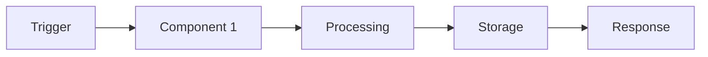

# 🔄 Гибридный Flow работы с документацией

**Обновлено:** 25.10.2025
**Статус:** ✅ **Активно**
**Версия:** 2.0

## 🎯 Философия гибридного подхода

**Сохраняем лучший из User Story + Добавляем техническую глубину**

- **User Story** - фокус на том, ЧТО хочет пользователь (бизнес-потребность)
- **Technical Design Document** - фокус на том, КАК это реализовать технически
- **Скорость > Бюрократии** - от идеи к коду за 3-5 часов
- **Гибкость > Формальности** - легкое разделение бизнес и технических аспектов

## 📋 Двухдокументная модель

### 🎯 **Document 1: User Story (US-XXX)**
```yaml
🎯 Фокус: Потребность пользователя
📝 Формат: As a... I want... So that...
👥 Автор: Product Owner или Developer
⏱️ Время создания: 1-2 часа
📊 Содержание: Бизнес-ценность, User Acceptance Criteria, Definition of Done
🎭 Роль: Описание проблемы с точки зрения пользователя
```

### 🏗️ **Document 2: Technical Design Document (TDD-XXX)**
```yaml
🎯 Фокус: Техническая реализация
📝 Формат: Архитектура, требования, план реализации
👥 Автор: Developer
⏱️ Время создания: 2-3 часа
📊 Содержание: Архитектура, компоненты, риски, тестирование, метрики
🎭 Роль: Полный технический план для реализации
```

## 🔄 Новый flow работы

### **Phase 1: User Story Creation (1-2 часа)**
```bash
1. Создать User Story из шаблона
2. Определить бизнес-потребность
3. Сформулировать User Acceptance Criteria
4. Определить бизнес-ценность и метрики
5. Получить одобрение (если нужно)
```

### **Phase 2: Technical Design (2-3 часа)**
```bash
1. Анализировать User Story
2. Создать Technical Design Document
3. Спроектировать архитектуру
4. Определить технические требования
5. Составить план реализации
6. Оценить риски и зависимости
```

### **Phase 3: Implementation (сразу)**
```bash
1. Следовать плану из TDD
2. Обновлять статусы документов
3. Добавлять implementation notes
4. Тестировать по чек-листу
```

### **Phase 4: Completion**
```bash
1. Отметить выполненные критерии в обоих документах
2. Обновить статусы на "Done"
3. Провести финальный review
4. Заархивировать при необходимости
```

## 📂 Структура документов

### 📝 **User Story Structure**
```yaml
US-XXX-название.md:
  📋 User Story + Приоритет + Story Points
  👥 User Acceptance Criteria (3 типа)
  🎯 Business Value + метрики
  🚫 Исключения и edge cases
  ✅ Definition of Done
  🔗 Связи с TDD-XXX
```

### 🏗️ **Technical Design Document Structure**
```yaml
TDD-XXX-название.md:
  🎯 Технические требования (Functional, Performance, Security)
  🏗️ Архитектура и компоненты
  📋 План реализации (фазы и задачи)
  ⚠️ Риски и зависимости
  🧪 План тестирования
  📊 Метрики успеха
  🔗 Связи с US-XXX
```

## 📊 Сравнение подходов

| Аспект | Enterprise (3 docs) | FIP (1 doc) | **Гибридный (2 docs)** |
|--------|-------------------|-------------|----------------------|
| **Фокус** | Разделение ролей | Технологии | **Пользователь + Технологии** |
| **Время до кода** | 3-7 дней | 2-4 часа | **3-5 часов** |
| **Скорость создания** | Медленная | Быстрая | **Средняя** |
| **Гибкость** | Низкая | Высокая | **Высокая** |
| **Качество** | Высокое | Среднее | **Высокое** |
| **Сложность** | Высокая | Низкая | **Средняя** |
| **Подходит для** | Enterprise | Individual | **Individual/Small Team** |

## ✅ Преимущества гибридного подхода

### 🎯 **Для бизнеса:**
- **Четкий фокус на пользователе** - User Story остается чистой и сфокусированной
- **Быстрый feedback** - можно быстро оценить бизнес-идею без технических деталей
- **Гибкие метрики** - легко адаптировать под изменения бизнес-требований

### 🏗️ **Для разработки:**
- **Техническая глубина** - TDD содержит всю необходимую техническую информацию
- **Быстрая реализация** - нет необходимости ждать технических спецификаций
- **Гибкость** - можно обновлять техническую часть без затрагивания бизнес-логики

### 🔄 **Для процесса:**
- **Разделение ответственности** - бизнес и технические аспекты четко разделены
- **Параллельная работа** - User Story и TDD могут создаваться параллельно
- **Легкое обновление** - изменения в одной части не ломают другую

## 🎯 Когда использовать гибридный подход

### ✅ **Идеально подходит:**
- Новые функции и фичи
- Интеграции с внешними сервисами
- Крупные рефакторинги
- Проекты с технической сложностью
- Small teams (1-5 человек)

### ❌ **Не подходит:**
- Simple bug fixes (< 1 часа)
- Documentation updates
- Configuration changes
- Очень простые задачи

## 📋 Шаблоны документов

### 🎯 **User Story Template**
```markdown
# User Story: US-XXX - [Название]

**Статус:** Draft/Approved/In Progress/Done
**Приоритет:** High/Medium/Low
**Story Points:** [число]
**Создан:** DD.MM.YYYY
**Обновлен:** DD.MM.YYYY

## 📝 User Story
**As a** [тип пользователя] **I want to** [что сделать] **so that** [почему это нужно]

## 👥 User Acceptance Criteria

### 🤖 Functional Criteria (Технические требования)
- [ ] **Given** [контекст] **When** [действие] **Then** [результат]

### 👥 User Acceptance Criteria (Пользовательские критерии)
- [ ] **Как пользователь** Я могу/чувствую/понимаю...

### 📊 Performance Criteria (Требования к производительности)
- [ ] **Response time:** < X seconds
- [ ] **Load testing:** X concurrent users

## 🎯 Business Value
- **Проблема:** [описание проблемы]
- **Решение:** [как User Story решает проблему]
- **Метрики успеха:** [конкретные измеримые метрики]
- **ROI:** [ожидаемая окупаемость]

## 🚫 Исключения и Edge Cases
- [ ] [Edge case 1]: [обработка]
- [ ] [Edge case 2]: [обработка]

## ✅ Definition of Done
- [ ] Все User Acceptance Criteria выполнены
- [ ] Functional Criteria реализованы
- [ ] Performance Criteria измерены
- [ ] Тестирование пройдено
- [ ] Code review выполнен

## 🔗 Связанные документы
- **Technical Design Document:** [TDD-XXX-название.md](TDD-XXX-название.md)
- **Зависимости:** [US-YYY, ...]
```

### 🏗️ **Technical Design Document Template**
```markdown
# Technical Design Document: TDD-XXX - [Название]

**Статус:** Draft/Ready/In Progress/Done
**Сложность:** Simple/Medium/Complex
**Приоритет:** High/Medium/Low
**Создан:** DD.MM.YYYY
**Обновлен:** DD.MM.YYYY
**User Story:** [US-XXX-название.md](US-XXX-название.md)

## 🎯 Технические требования

### Functional Requirements
- [ ] [Требование 1]: [описание]
- [ ] [Требование 2]: [описание]

### Non-Functional Requirements
- [ ] **Performance:** [требования к производительности]
- [ ] **Security:** [требования безопасности]
- [ ] **Scalability:** [требования масштабируемости]
- [ ] **Availability:** [требования доступности]

## 🏗️ Архитектура и компоненты

### System Architecture
```yaml
pattern: "Event-driven / Layered / Hexagonal"
approach: "Synchronous / Asynchronous"
style: "Modular / Service-oriented"
```

### Components
```yaml
components:
  - name: "ComponentName"
    type: "Controller/Service/Model/Job"
    responsibility: "Что этот компонент делает"
    dependencies: ["Other components", "External APIs"]
    interfaces: ["методы и API"]
```

### Data Flow


## 📋 План реализации

### Phase 1: Foundation (X часов)
- [ ] Создать/модифицировать модели данных
- [ ] Настроить контроллеры и endpoints
- [ ] Базовая структура сервисов

### Phase 2: Core Logic (Y часов)
- [ ] Реализовать основную бизнес-логику
- [ ] Интегрировать внешние сервисы
- [ ] Обработка ошибок и edge cases

### Phase 3: Integration & Testing (Z часов)
- [ ] Написать unit тесты
- [ ] Интеграционное тестирование
- [ ] E2E тестирование critical paths

### Phase 4: Polish (W часов)
- [ ] Оптимизация производительности
- [ ] Логирование и мониторинг
- [ ] Документация API

## ⚠️ Риски и зависимости

### Технические риски
- [ ] **High:** [критический риск] - [митигация]
- [ ] **Medium:** [средний риск] - [митигация]
- [ ] **Low:** [маленький риск] - [митигация]

### Зависимости
- [ ] [Внешняя зависимость 1]: [статус, риски]
- [ ] [Внутренняя зависимость 2]: [статус, риски]

### Технологический стек
- **Framework:** Ruby on Rails 8.1
- **Database:** PostgreSQL
- **AI:** ruby_llm gem
- **External:** [API, библиотеки]
- **Testing:** Minitest, RSpec

## 🧪 План тестирования

### Unit Testing
- [ ] Models: [покрытие > 90%]
- [ ] Services: [покрытие > 85%]
- [ ] Controllers: [покрытие > 80%]

### Integration Testing
- [ ] API endpoints
- [ ] External service integrations
- [ ] Database operations

### E2E Testing
- [ ] Critical user journeys
- [ ] Error scenarios
- [ ] Performance testing

## 📊 Метрики успеха

### Technical Metrics
- [ ] **Response time:** < 2 seconds (p95)
- [ ] **Throughput:** > X requests/second
- [ ] **Error rate:** < 1%
- [ ] **Availability:** > 99.9%
- [ ] **Code coverage:** > 80%

### Business Metrics
- [ ] [Бизнес-метрика 1]: [цель]
- [ ] [Бизнес-метрика 2]: [цель]

## 🔗 Связанные документы
- **User Story:** [US-XXX-название.md](US-XXX-название.md)
- **Dependencies:** [TDD-YYY, ...]
- **External documentation:** [ссылки]

## 📝 Implementation Notes
[Заметки и решения в процессе разработки]

## ✅ Completion Checklist
- [ ] Все технические требования реализованы
- [ ] Все тесты проходят
- [ ] Performance targets достигнуты
- [ ] Security review пройден
- [ ] Documentation обновлена
- [ ] User Story criteria выполнены

---

**Change log:**
| Дата | Версия | Изменение | Автор |
|------|--------|-----------|-------|
| DD.MM.YYYY | 1.0 | Initial version | [Name] |
```

## 🚀 Quick Start Checklist

### Перед созданием User Story:
- [ ] Определить целевого пользователя
- [ ] Понять бизнес-проблему
- [ ] Оценить приоритет и сложность

### Перед созданием TDD:
- [ ] Прочитать и понять User Story
- [ ] Определить технические ограничения
- [ ] Оценить зависимости и риски

### Перед реализацией:
- [ ] Оба документа одобрены
- [ ] План реализации понятен
- [ ] Окружение настроено

---

**Этот подход сохраняет фокус на пользователе, добавляя необходимую техническую глубину для качественной реализации.**