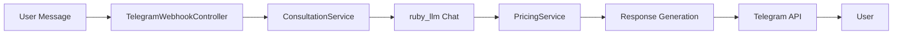

# Feature Implementation Plan: FIP-002a - Telegram Basic Consultation

**Приоритет:** High
**Сложность:** Simple
**Статус:** Draft
**Создан:** 25.10.2025
**Обновлен:** 25.10.2025
**User Story:** US-002a-telegram-basic-consultation.md

## 🎯 User Story

**As a** владелец автомобиля с повреждениями кузова, который хочет узнать ориентировочную стоимость ремонта
**I want to** получить быструю текстовую консультацию по кузовному ремонту через естественный диалог
**so that** я могу понять ориентировочную стоимость и принять решение о следующих шагах

### Критерии приемки
- [ ] **Functional:** Клиент описывает повреждение текстом → бот предоставляет ориентировочную стоимость
- [ ] **User Experience:** 80% клиентов получают удовлетворительный ответ за 1 диалог
- [ ] **Performance:** Ответ бота < 3 секунд на типичные запросы

## 🏗️ Технический подход

### Архитектура
```yaml
components:
  - name: "TelegramWebhookController"
    type: "Controller"
    responsibility: "Прием и обработка webhook от Telegram"
  - name: "ConsultationService"
    type: "Service"
    responsibility: "Основная логика консультации через ruby_llm"
  - name: "PricingService"
    type: "Service"
    responsibility: "Расчет цен по встроенным справочникам"
  - name: "Chat/Message модели"
    type: "Model (ruby_llm)"
    responsibility: "Сохранение истории диалогов"
```

### Основные технологии
- **Framework:** Ruby on Rails 8.1
- **AI:** ruby_llm gem (acts_as_chat, acts_as_message)
- **External:** Telegram API
- **Database:** PostgreSQL

### Data Flow


## 📋 План реализации

### Phase 1: Foundation (1 день)
- [ ] Настроить ConsultationService
- [ ] Создать PricingService с ценами
- [ ] Добавить system prompts для ruby_llm
- [ ] Настроить Chat/Message модели

### Phase 2: Integration (1 день)
- [ ] Интегрировать с существующим TelegramWebhookController
- [ ] Реализовать основную логику консультации
- [ ] Добавить обработку ошибок
- [ ] Настроить сохранение диалогов

### Phase 3: Polish (0.5 дня)
- [ ] Написать тесты
- [ ] Оптимизировать prompts
- [ ] Тестирование на реальных запросах

## ⚠️ Риски и зависимости

**Риски:**
- [ ] **Low:** AI не понимает сложные повреждения
- [ ] **Low:** Пользователи запрашивают точную цену
- [ ] **Low:** Нагрузка на LLM провайдера

**Зависимости:**
- [x] US-001 приветствие (уже реализовано)
- [ ] ruby_llm gem настроен
- [ ] Telegram webhook работает

## 🧪 Тестирование

**Что протестировать:**
- [ ] Основные типы запросов (вмятина, царапина, покраска)
- [ ] Понимание контекста диалога
- [ ] Корректность ценовых диапазонов
- [ ] Обработка нестандартных запросов
- [ ] Скорость ответа (< 3 секунд)

## 📊 Метрики успеха

**Functional:**
- [ ] 80% клиентов получают удовлетворительный ответ за 1 диалог
- [ ] Бот понимает основные типы кузовных повреждений
- [ ] Ориентировочные цены соответствуют рыночным

**Technical:**
- [ ] Response time < 3 seconds
- [ ] No critical errors
- [ ] Code coverage > 80%
- [ ] Dialogs сохраняются в ruby_llm

## 💰 Встроенные цены (MVP)

### PDR (ремонт без покраски):
- Маленькая вмятина (до 5 см): 5000-7000₽
- Средняя вмятина (5-15 см): 7000-10000₽
- Большая вмятина (15-25 см): 10000-15000₽

### Локальная покраска:
- Элемент до 1м²: 8000-12000₽
- Элемент 1-2м²: 12000-18000₽

### Полировка кузова:
- Частичная полировка: 4000-6000₽
- Полная полировка: 8000-12000₽

## 💬 Пример диалога

```
Клиент: Привет! Есть вмятина на двери, сколько стоит починить?

Бот: Здравствуйте! Помогу сориентироваться по стоимости.
🚗 Расскажите подробнее:
- Какая дверь (передняя/задняя, левая/правая)?
- Примерный размер вмятины?
- Краска целая или повреждена?

Клиент: Передняя левая, размером с ладонь, краска целая

Бот: Понял! Это классический случай для PDR (ремонт без покраски).
💰 Ориентировочная стоимость: 7000-10000₽
⏰ Срок ремонта: 1-2 дня

Точную стоимость назовем после бесплатного осмотра - это ни к чему не обязывает. Хотите, расскажу как записаться?
```

---

**Implementation notes:**
- Использовать существующую архитектуру US-001
- Добавить новые service классы без изменения core logic
- Встроенные цены хранить в константах или конфиге
- Focus на естественном диалоге (Product Constitution compliance)

**Change log:**
| Дата | Изменение |
|------|-----------|
| 25.10.2025 | Initial version from US-002a |
| | |