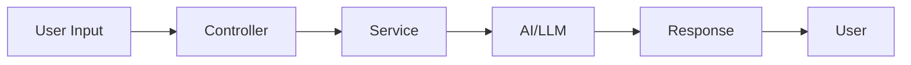

# Feature Implementation Plan: FIP-XXX - [Название функции]

**Приоритет:** High/Medium/Low
**Сложность:** Simple/Medium/Complex
**Статус:** Draft/In Progress/Done
**Создан:** DD.MM.YYYY
**Обновлен:** DD.MM.YYYY

## 🎯 User Story

**As a** [тип пользователя] **I want to** [что сделать] **so that** [почему это нужно].

### Критерии приемки
- [ ] **Functional:** [Основной функционал]
- [ ] **User Experience:** [Опыт пользователя]
- [ ] **Performance:** [Производительность]

## 🏗️ Технический подход

### Архитектура
```yaml
components:
  - name: "Основной компонент"
    type: "Controller/Model/Service/Job"
    responsibility: "Что делает"
  - name: "Вспомогательный компонент"
    type: "Model/Service"
    responsibility: "Поддерживающая функция"
```

### Основные технологии
- **Framework:** Ruby on Rails 8.1
- **AI:** ruby_llm gem
- **External:** Telegram API
- **Database:** PostgreSQL

### Data Flow


## 📋 План реализации

### Phase 1: Foundation (X дней)
- [ ] Создать/изменить модели
- [ ] Настроить контроллеры
- [ ] Базовые сервисы

### Phase 2: Integration (Y дней)
- [ ] Настроить внешние API
- [ ] Реализовать основную логику
- [ ] Обработка ошибок

### Phase 3: Polish (Z дней)
- [ ] Тестирование
- [ ] Оптимизация
- [ ] Документация

## ⚠️ Риски и зависимости

**Риски:**
- [ ] **High:** [Критический риск]
- [ ] **Medium:** [Средний риск]
- [ ] **Low:** [Маленький риск]

**Зависимости:**
- [ ] [Зависимость 1]
- [ ] [Зависимость 2]

## 🧪 Тестирование

**Что протестировать:**
- [ ] Основной функционал (unit тесты)
- [ ] Интеграции (integration тесты)
- [ ] User journey (e2e тесты)

## 📊 Метрики успеха

**Functional:**
- [ ] Все критерии приемки выполнены
- [ ] Тесты проходят
- [ ] Пользователь может выполнить задачу

**Technical:**
- [ ] Response time < 2 seconds
- [ ] No critical errors
- [ ] Code coverage > 80%

---

**Implementation notes:**
[Заметки и решения в процессе разработки]

**Change log:**
| Дата | Изменение |
|------|-----------|
| DD.MM.YYYY | Initial version |