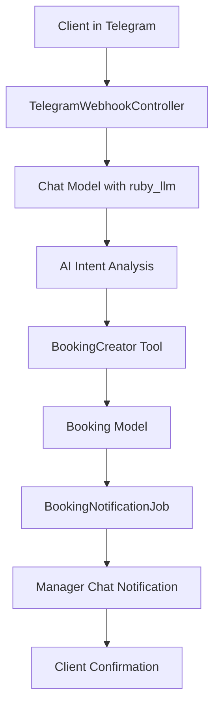

# Technical Design Document: TDD-002b - Telegram Recording + Booking

**Статус:** Draft
**Сложность:** Simple
**Приоритет:** High
**Создан:** 25.10.2025
**Обновлен:** 25.10.2025
**User Story:** [../user_stories/US-002b-telegram-recording-booking.md](../user_stories/US-002b-telegram-recording-booking.md)

## 🎯 Технические требования

### Functional Requirements
- [ ] **FR-001:** Клиент может записаться на осмотр через естественный диалог в Telegram
- [ ] **FR-002:** AI собирает необходимые данные (имя, телефон, авто, предпочтительное время) из контекста диалога
- [ ] **FR-003:** Система создает заявку и автоматически отправляет уведомление в менеджерский чат
- [ ] **FR-004:** Клиент получает подтверждение записи с датой, временем и адресом
- [ ] **FR-005:** Обработка случаев когда все временные слоты заняты

### Non-Functional Requirements
- [ ] **Performance:**
  - Response time: < 3 seconds (p95) для ответов бота
  - Notification delivery: < 5 seconds
  - Concurrent users: 50
- [ ] **Security:**
  - Authentication: Telegram webhook token validation
  - Authorization: Public bot access
  - Data encryption: PII data encryption at rest
- [ ] **Scalability:**
  - Horizontal scaling: Stateless bot handlers
  - Load balancing: Solid Queue for background jobs
- [ ] **Availability:**
  - Uptime: > 99.9%
  - Disaster recovery: Retry mechanisms for notifications

## 🏗️ Архитектура и компоненты

### System Architecture
```yaml
pattern: "Event-driven with Tool Calling"
approach: "Hybrid (Synchronous AI response + Asynchronous notifications)"
style: "Modular with LLM Tool integration"
```

### High-Level Architecture


### Components
```yaml
components:
  - name: "TelegramWebhookController"
    type: "Controller"
    responsibility: "Прием webhook от Telegram, передача в LLM"
    dependencies: ["Telegram API", "Chat model"]
    interfaces: ["POST /webhook/telegram"]
    scaling: "Stateless, horizontally scalable"
    implementation_status: "✅ ГОТОВО (требует минимальных изменений)"

  - name: "BookingCreator Tool"
    type: "LLM Tool (ruby_llm)"
    responsibility: "Создание записи через tool calling mechanism"
    dependencies: ["Chat model", "Booking model", "Validation"]
    interfaces: ["tool handler with parameters"]
    scaling: "Stateless"
    implementation_status: "⚠️ НУЖНА РЕАЛИЗАЦИЯ"

  - name: "BookingNotificationJob"
    type: "Job"
    responsibility: "Асинхронная отправка заявок в менеджерский чат"
    dependencies: ["Solid Queue", "Telegram API"]
    interfaces: ["perform_later method"]
    scaling: "Queue-based, horizontally scalable"
    implementation_status: "⚠️ НУЖНА РЕАЛИЗАЦИЯ"

  - name: "Booking Model"
    type: "Model"
    responsibility: "Хранение заявок со статусами и валидация"
    dependencies: ["PostgreSQL", "TelegramUser", "Chat"]
    interfaces: ["ActiveRecord interface"]
    scaling: "Database scaling through read replicas"
    implementation_status: "⚠️ НУЖНА РЕАЛИЗАЦИЯ"

  - name: "Chat Model"
    type: "Model"
    responsibility: "Сохранение истории диалогов, tool registration"
    dependencies: ["ruby_llm", "Message model"]
    interfaces: ["acts_as_chat, tool registration"]
    scaling: "Database scaling"
    implementation_status: "✅ ГОТОВО"
```

### Data Architecture
```yaml
data_models:
  - name: "Booking"
    purpose: "Хранение заявок на осмотр"
    key_fields: ["customer_name", "customer_phone", "car_brand", "car_model", "car_year", "scheduled_at", "status"]
    relationships: "belongs_to :telegram_user, belongs_to :chat"
    indexing: ["telegram_user_id", "scheduled_at", "status", "created_at"]
    validations: "phone format, required fields, date validation"

data_flow:
  - source: "User message via Telegram"
  - processing: "ruby_llm tool calling analysis"
  - storage: "Booking record creation"
  - output: "Manager notification + Client confirmation"
```

## 📋 План реализации

### Phase 1: Foundation (8 часов)
- [ ] **Database Design:**
  - [ ] Создать Booking модель с migrations
  - [ ] Добавить indexes для производительности
  - [ ] Настроить validations и associations
- [ ] **Basic Structure:**
  - [ ] Создать базовую структуру BookingCreatorTool
  - [ ] Настроить tool registration в Chat модели
  - [ ] Добавить error handling foundation

### Phase 2: Core Logic (8 часов)
- [ ] **Business Logic:**
  - [ ] Реализовать BookingCreatorTool с полной логикой
  - [ ] Добавить data extraction из AI контекста
  - [ ] Реализовать time slot determination logic
- [ ] **External Integrations:**
  - [ ] Создать BookingNotificationJob
  - [ ] Настроить Telegram API client для уведомлений
  - [ ] Добавить retry logic для delivery

### Phase 3: Features & Functionality (4 часа)
- [ ] **Core Features:**
  - [ ] Полная реализация tool calling flow
  - [ ] Обработка edge cases (слоты заняты, неверные данные)
  - [ ] Формирование confirmation сообщений
- [ ] **AI Integration:**
  - [ ] Обновить системный промпт для booking scenarios
  - [ ] Настроить context extraction для имен и контактов
  - [ ] Тестирование AI response patterns

### Phase 4: Integration & Testing (4 часа)
- [ ] **Testing:**
  - [ ] Unit тесты для Booking модели
  - [ ] Tool calling тесты
  - [ ] Integration тесты полного flow
- [ ] **Performance:**
  - [ ] Оптимизация database queries
  - [ ] Load testing для webhook endpoints

**Total Implementation Time: 24 часов (3 дня)**

## ⚠️ Риски и зависимости

### Технические риски
```yaml
high_risks:
  - risk: "AI incorrectly extracts user data from context"
    probability: "Medium"
    impact: "High"
    mitigation: "Strong validation in tool handler + fallback questions"
    owner: "Developer"

medium_risks:
  - risk: "Telegram API rate limits for notifications"
    probability: "Medium"
    impact: "Medium"
    mitigation: "Rate limiting + queue delays + fallback email"
    owner: "Developer"

low_risks:
  - risk: "Manager chat unavailable for notifications"
    probability: "Low"
    impact: "Low"
    mitigation: "Multiple manager contacts + retry with exponential backoff"
    owner: "Developer"
```

### Зависимости
```yaml
internal_dependencies:
  - component: "US-001 (приветствие)"
    status: "Available"
    risks: "Changes in greeting flow"
    mitigation: "Independent implementation, only context sharing"

  - component: "US-002a (консультация)"
    status: "In Progress"
    risks: "Changes in consultation context"
    mitigation: "Shared dialog history through Chat model"

external_dependencies:
  - service: "Telegram Bot API"
    status: "Available"
    risks: "API changes, downtime"
    mitigation: "Webhook retries + graceful degradation"

  - service: "Manager Telegram Chat"
    status: "Required"
    risks: "Chat availability, permissions"
    mitigation: "Multiple backup contacts + fallback notifications"

infrastructure_dependencies:
  - resource: "PostgreSQL Database"
    status: "Available"
    risks: "Performance at scale"
    mitigation: "Proper indexing + read replicas for scaling"

  - resource: "Solid Queue"
    status: "Available"
    risks: "Job failures"
    mitigation: "Retry mechanisms + dead letter queue"
```

### Технологический стек
```yaml
backend:
  framework: "Ruby on Rails 8.1"
  language: "Ruby 3.4+"

database:
  primary: "PostgreSQL 15+"
  cache: "Redis 7+"

ai_ml:
  primary: "ruby_llm gem (~> 1.8)"
  models: "OpenAI GPT-4 / Anthropic Claude"

external_services:
  - name: "Telegram Bot API"
    purpose: "Bot communication"
    auth: "Bot token"

testing:
  framework: "Minitest"
  tools: "FactoryBot, WebMock, VCR"

deployment:
  platform: "Docker"
  background_jobs: "Solid Queue"
  monitoring: "Rails logs + health checks"
```

## 🧪 План тестирования

### Unit Testing
```yaml
models:
  coverage_target: "90%+"
  focus: "Booking validations, associations, status transitions"

tools:
  coverage_target: "85%+"
  focus: "Parameter validation, error handling, data extraction"

jobs:
  coverage_target: "85%+"
  focus: "Notification delivery, retry logic"
```

### Integration Testing
```yaml
tool_calling_flow:
  focus: "AI to tool integration, parameter passing, response handling"

database_operations:
  focus: "Booking creation, status updates, data consistency"

telegram_integration:
  focus: "Webhook processing, message delivery, error responses"
  tools: "WebMock, VCR"
```

### E2E Testing
```yaml
critical_user_journeys:
  - "Complete flow: consultation → booking → confirmation"
  - "Error scenarios: missing data, invalid phone, full schedule"
  - "Manager notification: delivery, format, follow-up"

performance_testing:
  tool: "k6 or custom Rails benchmarking"
  scenarios: "Concurrent booking requests, webhook throughput"
  targets: "Response time < 3s, notification < 5s"

ai_testing:
  focus: "Intent recognition, data extraction accuracy, natural dialogue"
  approach: "Manual testing + sample dialog validation"
```

## 📊 Метрики успеха

### Technical Metrics
- [ ] **Response time:** < 3 seconds (p95) для AI responses
- [ ] **Notification delivery:** < 5 seconds (p95)
- [ ] **Error rate:** < 1% for booking creation
- [ ] **Availability:** > 99.9% for booking service
- [ ] **Code coverage:** > 80%
- [ ] **Test success rate:** 100%

### Business Metrics (из User Story)
- [ ] **Конверсия в запись:** 60% консультаций → создание заявки
- [ ] **Проходимость:** 90% созданных заявок подтверждаются менеджерами
- [ ] **Посещаемость:** 95% клиентов приходят на осмотр после подтверждения

### Performance Metrics
- [ ] **Database query time:** < 100ms (p95)
- [ ] **Memory usage:** < 512MB per Rails process
- [ ] **CPU usage:** < 70% under normal load
- [ ] **Tool processing time:** < 2 seconds

## 🔗 Связанные документы
- **User Story:** [../user_stories/US-002b-telegram-recording-booking.md](../user_stories/US-002b-telegram-recording-booking.md)
- **Dependencies:** US-001, US-002a
- **External documentation:**
  - [ruby_llm gem documentation](../gems/ruby_llm/)
  - [Telegram Bot API](../gems/telegram-bot/)
- **Previous version:** [_archive/FIP-002b-telegram-recording-booking.md](_archive/FIP-002b-telegram-recording-booking.md)

## 📝 Implementation Notes

### Phase Decisions:
1. **LLM Tool Approach:** Выбран вместо форм с кнопками для соответствия Product Constitution (dialogue-only interaction)
2. **Asynchronous Notifications:** Использовать Solid Queue для надежной доставки уведомлений менеджерам
3. **Context-based Data Extraction:** AI извлекает данные из истории диалога вместо заполнения форм

### Technical Challenges:
- **AI Data Accuracy:** Требуется тщательное тестирование extraction accuracy из диалогового контекста
- **Time Slot Logic:** Упрощенная логика слотов для MVP, возможнаfuture доработка до динамической системы
- **Error Recovery:** Graceful handling случаев когда AI не может извлечь необходимые данные

### Lessons Learned:
- **Tool Registration:** ruby_llm tool система требует четкой parameter схемы и валидации
- **Context Management:** Важность сохранения полного диалогового контекста для data extraction
- **Notification Reliability:** Асинхронные уведомления критически важны для business process

## ✅ Completion Checklist

### Functional Requirements:
- [ ] All functional requirements implemented
- [ ] User Story criteria satisfied
- [ ] Edge cases handled (full schedule, invalid data)
- [ ] Error scenarios covered

### Technical Requirements:
- [ ] Performance targets achieved (< 3s response)
- [ ] Security requirements met (webhook validation)
- [ ] Scalability tested (concurrent users)
- [ ] Availability verified (retry mechanisms)

### Quality Assurance:
- [ ] Unit tests written and passing (> 80% coverage)
- [ ] Integration tests passing
- [ ] E2E tests passing
- [ ] Code review completed
- [ ] Manual testing with sample dialogues

### Documentation:
- [ ] API documentation updated
- [ ] Manager notification format documented
- [ ] Deployment guides updated
- [ ] Troubleshooting runbooks created

### Deployment Readiness:
- [ ] Environment configured
- [ ] Migration scripts tested
- [ ] Health checks implemented
- [ ] Monitoring configured
- [ ] Rollback plan ready

---

**Change log:**
| Дата | Версия | Изменение | Автор |
|------|--------|-----------|-------|
| 25.10.2025 | 1.0 | Initial version from FIP-002b conversion | Claude Code Assistant |

---

**Approval:**
- [ ] Tech Lead: _________________________ Date: _______
- [ ] Senior Developer: __________________ Date: _______