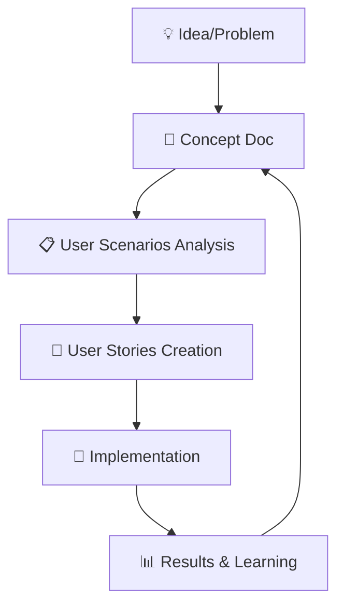

# 📚 Организация документации проекта

**Создана:** 27.10.2025
**Версия:** 1.0
**Статус:** Active Documentation Standard

---

## 🎯 Принципы организации

### **Core Philosophy:**
- **Разделение концепций и реализаций**
- **Четкая навигация для разных ролей** (Product Owner, разработчики, AI)
- **Масштабируемость** и легкое добавление новых материалов
- **Traceability** от идей до реализации

---

## 📁 Структура директорий

```
docs/
├── 🧠 concepts/                    # Архитектурные концепции
│   ├── contextual-dialog-system.md    # AI-контекстные диалоги
│   └── [future-concepts].md           # Будущие концепции
│
├── 📋 user-scenarios/               # Сценарии поведения пользователей
│   ├── 01-primary-dialog.md           # Первичные обращения
│   ├── 02-post-booking-dialog.md      # Пост-бронинговые вопросы
│   ├── 03-service-dialog.md           # Сервисные консультации
│   ├── 04-complaint-resolution.md      # Разрешение жалоб
│   ├── 05-sales-objection-handling.md # Работа с возражениями
│   ├── 06-photo-based-assessment.md   # Фото-оценка повреждений
│   ├── 07-ideal-booking-flow.md       # Идеальный flow записи
│   └── DIALOG_STARTED_v2_IMPLEMENTATION_PLAN.md
│
├── 📝 requirements/                 # Требования и фичи
│   └── user-stories/                    # User Stories (T-shirt sizing)
│       ├── US-001-telegram-greeting.md
│       ├── US-002a-telegram-consultation.md
│       └── US-002b-telegram-recording-booking.md
│
├── 🏗️ architecture/                 # Архитектурные решения
│   ├── decisions.md                     # ADR (Architecture Decision Records)
│   └── patterns.md                      # Паттерны проектирования
│
├── 🔧 development/                  # Гайды разработки
│   ├── README.md                       # Основной гайд разработчика
│   ├── stack.md                        # Технологический стек
│   └── patterns/                       # Паттерны кода
│       └── error-handling.md           # Обработка ошибок
│
├── 📊 product/                      # Продуктовая документация
│   ├── constitution.md                 # Конституция продукта
│   └── business-metrics.md             # Бизнес метрики
│
├── 🧪 testing/                      # Тестирование
│   └── scenarios/                      # Тестовые сценарии
│
└── 🔍 patterns/                     # Паттерны и Best Practices
    ├── error-handling.md               # Обработка ошибок
    └── [other-patterns].md
```

---

## 🎯 Сущности и их назначение

### **🧠 Concepts (`docs/concepts/`)**
**Назначение:** Архитектурные концепции и системные решения

**Когда создавать:**
- 🔥 **Новые идеи** spanning multiple User Stories
- 🏗️ **Архитектурные решения** влияющие на систему
- 💡 **Инновационные подходы** к существующим проблемам
- 🔄 **Эволюция систем** (например, DIALOG_STARTED v1 → v2)

**Примеры:**
- Контекстуальная система диалогов
- AI-powered фото-оценка повреждений
- Система персонализации пользователя
- Архитектура микросервисов

---

### **📋 User Scenarios (`docs/user-scenarios/`)**
**Назначение:** Поведенческие паттерны и реальные сценарии использования

**Когда создавать:**
- 🎭 **Анализ поведения** пользователей
- 📊 **Выявление паттернов** из реальных диалогов
- 🎯 **Оптимизация user journey**
- 📝 **Подготовка к реализации** User Stories

**Примеры:**
- Идеальный flow записи (7 шагов)
- Разрешение жалоб клиентов
- Работа с ценовыми возражениями
- Пост-бронинговые уточнения

---

### **📝 User Stories (`docs/requirements/user-stories/`)**
**Назначение:** Конкретные фичи для реализации с T-shirt sizing

**Когда создавать:**
- ✅ **Конкретная функциональность** с понятной ценностью
- 🎯 **Ограниченный scope** (1-2 недели реализации)
- 👥 **Понятный user benefit** и acceptance criteria
- 📏 **Измеримый результат** и бизнес-ценность

**Примеры:**
- US-001: Приветствие новых пользователей
- US-002a: Консультация по стоимости услуг
- US-002b: Запись на автосервис

---

### **🏗️ Architecture (`docs/architecture/`)**
**Назначение:** Технические решения и ADR

**Когда создавать:**
- 🔧 **Технические решения** с long-term влиянием
- 🏗️ **Выбор технологий** и архитектурных паттернов
- 📊 **Производительность** и масштабирование
- 🔒 **Безопасность** и инфраструктура

---

## 🔄 Жизненный цикл документации

### **Flow: Concept → Scenario → Story → Implementation**



### **Phase 1: Концептуализация**
1. **Идея/Проблема** → Создание `concept` документа
2. **Анализ сценариев** → Создание `user-scenarios`
3. **Product Owner review** → Утверждение концепции

### **Phase 2: Планирование**
1. **Декомпозиция** → User Stories с T-shirt sizing
2. **Приоритизация** → Backlog grooming
3. **Оценка ресурсов** → Implementation timeline

### **Phase 3: Реализация**
1. **Development** → Код + тесты
2. **Documentation update** → Обновление всех связанных документов
3. **Knowledge transfer** → Обучение команды

### **Phase 4: Анализ**
1. **Results measurement** → Бизнес и технические метрики
2. **Lessons learned** → Обновление концепций
3. **Improvement cycle** → Новые идеи

---

## 🎯 Правила создания и поддержания

### **📝 Правила именования:**
- **Concepts:** `kebab-case.md` (например, `contextual-dialog-system.md`)
- **User Scenarios:** `NN-description.md` (например, `01-primary-dialog.md`)
- **User Stories:** `US-XXX-description.md` (например, `US-001-telegram-greeting.md`)

### **🔗 Правила связывания:**
- **Cross-references:** Всегда ссылаться на связанные документы
- **Traceability:** От Concept → Scenarios → Stories → Implementation
- **Backwards compatibility:** Обновлять все связанные документы при изменениях

### **✅ Quality Gates:**
- **Concepts:** Нужен Product Owner review перед implementation
- **User Scenarios:** Должны быть основаны на реальных данных или наблюдениях
- **User Stories:** Должны иметь четкие acceptance criteria
- **All docs:** Актуальность и consistency

---

## 👥 Роли и ответственности

### **Product Owner:**
- ✅ **Утверждение concepts** и приоритизация
- 📊 **Business value assessment** концепций
- 🎯 **User scenarios validation**
- 📋 **User Stories approval**

### **Developers:**
- 🔧 **Implementation** согласно концепциям
- 📝 **Technical documentation** в architecture/
- 🧪 **Test scenarios** в testing/
- 🔄 **Code reviews** соответствия концепциям

### **AI Assistant:**
- 💡 **Concept generation** и анализ
- 📋 **User scenarios identification**
- 📝 **Documentation creation** и поддержание
- 🔍 **Cross-reference tracking**

---

## 🚀 Best Practices

### **📚 Content Guidelines:**
1. **Start with WHY** - всегда объясняйте цель концепции
2. **Include examples** - реальные примеры использования
3. **Add metrics** - как измерять успех
4. **Consider alternatives** - почему выбран этот подход
5. **Implementation path** - четкие следующие шаги

### **🔄 Maintenance:**
1. **Regular reviews** - quarterly документация reviews
2. **Version control** - semantic versioning для concepts
3. **Archive outdated** - перемещать устаревшие концепции
4. **Cross-link cleanup** - обновление ссылок при изменениях

### **📊 Success Metrics:**
- **Usage:** Как часто команда обращается к документации
- **Accuracy:** Насколько docs соответствуют реальности
- **Completeness:** Покрывают ли docs все аспекты системы
- **Actionability:** Помогают ли docs принимать решения

---

## 🛠️ Инструменты и шаблоны

### **📝 Шаблоны документов:**

#### **Concept Template:**
```markdown
# 🧠 Концепция: [Название]

**Статус:** Draft/Ready for Review/Approved
**Приоритет:** High/Medium/Low

## 🎯 Проблема
## 💡 Решение
## 🏗️ Архитектура
## 📊 Бизнес-ценность
## 🔧 Реализация
## ✅ Success Metrics
## 🤔 Questions for PO
```

#### **User Scenario Template:**
```markdown
# 📋 Сценарий X: [Название]

**Категория:** [Тип сценария]
**Приоритет:** High/Medium/Low

## 🎯 Описание
## 📊 Примеры диалогов
## 🎯 Ключевые метрики
## 🎨 AI-стратегии
## 🔄 Связь с User Stories
```

---

## 📈 Эволюция системы

### **Phase 1 (Current):** Foundation
- ✅ Basic structure established
- ✅ DIALOG_STARTED concept created
- ✅ User scenarios framework built
- ✅ Documentation organization defined

### **Phase 2 (Future):** Optimization
- 🔄 Automated cross-linking
- 🔄 Visual documentation (diagrams, flows)
- 🔄 Interactive documentation
- 🔄 AI-powered concept suggestions

### **Phase 3 (Future):** Intelligence
- 🔄 Knowledge graph of concepts
- 🔄 Automated impact analysis
- 🔄 Predictive documentation updates
- 🔄 Integration with development tools

---

**Версия:** 1.0 | **Последнее обновление:** 27.10.2025 | **Reviewer:** AI Assistant