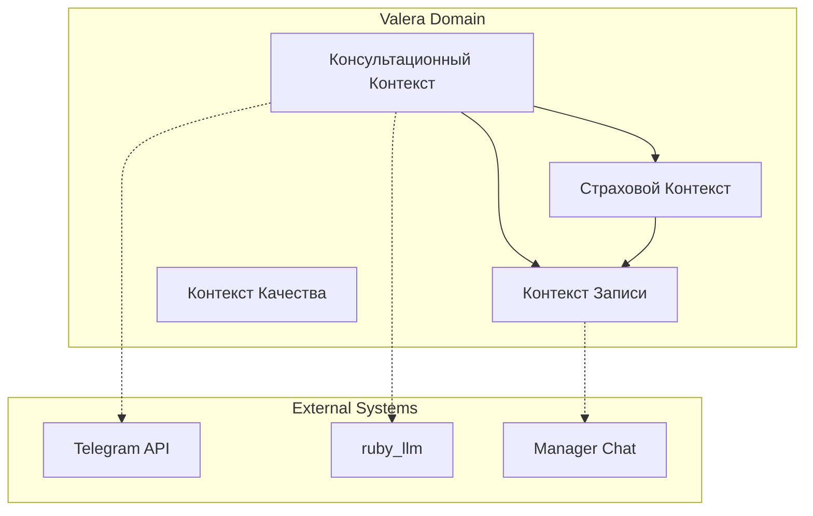

# 🎯 Bounded Contexts - Ограниченные контексты

**Обновлено:** 26.10.2025
**Статус:** ✅ **Контексты определены**
**Версия:** 1.0

## 🎯 Назначение

Этот документ определяет ограниченные контексты (Bounded Contexts) домена AI-ассистента Valera. Каждый контекст имеет четкие границы ответственности, специфическую терминологию и бизнес-правила, что обеспечивает модульность и понятность системы.

## 📋 Карта контекстов



## 🗣️ 1. Консультационный Контекст (Consultation Context)

### **Ответственность:**
Ведение диалога с клиентом, понимание потребностей, предоставление экспертной информации

### **Основные сущности:**
- Клиент (Customer)
- Диалог (Conversation)
- Запрос на консультацию (ConsultationRequest)
- Экспертное знание (ExpertKnowledge)

### **Ключевые процессы:**
1. **Приветствие и идентификация** - установление контакта
2. **Активное слушание** - понимание проблемы клиента
3. **Экспертная консультация** - предоставление профессиональной информации
4. **Определение следующих шагов** - планирование действий

### **Терминология контекста:**
- **Консультация** - экспертный совет по ремонту
- **Рекомендация** - предложение конкретного решения
- **Проблема** - описание ситуации клиента
- **Решение** - предлагаемый вариант действий

### **Бизнес-правила:**
- AI всегда говорит как эксперт с 10-летним опытом
- Каждая консультация должна заканчиваться конкретным следующим шагом
- AI должен объяснять сложные термины простым языком
- Недостаток информации требует уточняющих вопросов

### **Пограничные условия:**
**Вход:** Любое сообщение от клиента
**Выход:** Понятая проблема и определенный следующий шаг
**Интеграции:** Telegram API, ruby_llm

### **Метрики качества:**
- Понимание запроса клиента > 85%
- Удовлетворенность консультацией > 80%
- Время до следующего шага < 3 минут

## 📋 2. Страховой Контекст (Insurance Context)

### **Ответственность:**
Помощь в оформлении страховых случаев, работа с документами

### **Основные сущности:**
- Страховой случай (InsuranceClaim)
- Документы (Documents)
- Страховая компания (InsuranceCompany)
- Полис (Policy)

### **Ключевые процессы:**
1. **Идентификация страхового случая** - распознавание mentions ДТП, ОСАГО, КАСКО
2. **Сбор документов** - определение требуемых документов
3. **Проверка документов** - валидация полисов и справок
4. **Инструктирование** - пошаговые инструкции для клиента
5. **Подготовка пакета** - комплектация документов для страховой

### **Терминология контекста:**
- **Страховой случай** - ситуация, покрываемая страховкой
- **Европротокол** - упрощенное оформление ДТП
- **Пакет документов** - комплект бумаг для страховой
- **Экспертиза** - оценка ущерба страховой компанией

### **Бизнес-правила:**
- AI не дает юридических консультаций, только инструктаж
- Все документы должны быть проверены на полноту
- Клиент должен быть проинструктирован о сроках и процедурах
- При сложных случаях рекомендуется помощь юриста

### **Пограничные условия:**
**Вход:** Упоминание страховой ситуации в диалоге
**Выход:** Инструкции и полный пакет документов
**Интеграции:** OCR сервисы (будущее), справочники страховых

### **Метрики качества:**
- Правильность определения типа страховки > 90%
- Полнота собранных документов > 95%
- Удовлетворенность инструкциями > 85%

## 📅 3. Контекст Записи (Booking Context)

### **Ответственность:**
Бронирование времени, создание заявок, передача менеджерам

### **Основные сущности:**
- Заявка (ServiceRequest)
- Календарь (Calendar)
- Менеджер (Manager)
- Временной слот (TimeSlot)

### **Ключевые процессы:**
1. **Сбор информации** - данные об автомобиле, пожелания по времени
2. **Проверка доступности** - поиск свободных слотов
3. **Предложение вариантов** - доступное время для записи
4. **Подтверждение** - финализация записи
5. **Передача менеджеру** - создание заявки в системе

### **Терминология контекста:**
- **Запись** - бронирование времени для обслуживания
- **Заявка** - формализованный запрос на ремонт
- **Временной слот** - конкретное время для записи
- **Менеджер** - сотрудник, обрабатывающий заявку

### **Бизнес-правила:**
- Заявка должна содержать всю необходимую информацию
- Менеджер должен получить заявку в течение 5 минут
- Клиент должен получить подтверждение записи
- Время записи должно быть согласовано с клиентом

### **Пограничные условия:**
**Вход:** Желание клиента записаться на сервис
**Выход:** Созданная заявка и подтверждение клиенту
**Интеграции:** Manager Chat, календарная система

### **Метрики качества:**
- Время создания заявки < 2 минут
- Полнота информации в заявке > 90%
- Конверсия в запись > 60%

## ✅ 4. Контекст Качества (Quality Context)

### **Ответственность:**
Контроль качества обслуживания, сбор обратной связи, улучшение процессов

### **Основные сущности:**
- Качество обслуживания (ServiceQuality)
- Обратная связь (Feedback)
- Метрики (Metrics)
- Улучшения (Improvements)

### **Ключевые процессы:**
1. **Мониторинг диалогов** - анализ качества AI-ответов
2. **Сбор обратной связи** - отзывы клиентов
3. **Анализ метрик** - оценка эффективности контекстов
4. **Выявление проблем** - поиск узких мест
5. **Реализация улучшений** - обновление AI и процессов

### **Терминология контекста:**
- **Качество обслуживания** - соответствие ожиданиям клиента
- **Метрика** - измеримый показатель эффективности
- **Улучшение** - изменение для повышения качества
- **Обратная связь** - мнение клиента об обслуживании

### **Бизнес-правила:**
- Все диалоги должны анализироваться на качество
- Негативная обратная связь требует немедленной реакции
- Метрики должны отслеживаться в реальном времени
- Улучшения должны основываться на данных

### **Пограничные условия:**
**Вход:** Данные из всех контекстов
**Выход:** Рекомендации по улучшению и метрики качества
**Интеграции:** Аналитические системы, системы мониторинга

### **Метрики качества:**
- Общая удовлетворенность > 85%
- Время реакции на проблемы < 1 час
- Количество улучшений в месяц > 5

## 🔄 Взаимодействие контекстов

### **Последовательность типового сценария:**
```
Консультационный → (Опционально) Страховой → Запись
     ↓                       ↓                  ↓
   Качество ←←←←←←←←←←←←←←←←←←←←←←←←←←←←←←←←←
```

### **Контрактные взаимодействия:**

**Консультационный → Страховой:**
- Передача: Информация о повреждении + Подозрение на страховой случай
- Обратная связь: Требуемые документы + Инструкции

**Консультационный → Запись:**
- Передача: Предварительная оценка + Рекомендуемые услуги
- Обратная связь: Подтверждение клиента + Время записи

**Все контексты → Качество:**
- Передача: Данные о взаимодействиях + Результаты
- Обратная связь: Метрики + Рекомендации по улучшению

## 🚫 Анти-паттерны контекстов

### **Размытие границ:**
- ❌ Консультационный контекст не должен давать юридических консультаций
- ❌ Страховой контекст не должен записывать на сервис

### **Нарушение ответственности:**
- ❌ Контекст качества не должен напрямую взаимодействовать с клиентами
- ❌ Запись не должна миновать консультационный контекст

### **Игнорирование интеграций:**
- ❌ Контексты не должны работать в изоляции
- ❌ Отсутствие передачи данных между контекстами
- ❌ Дублирование функциональности в разных контекстах

## 🔗 Связанные документы

- **Domain Models:** `models.md` - Сущности контекстов
- **Terminology:** `terminology.md` - Объединенная терминология и бизнес-правила

---

**Последнее обновление:** 26.10.2025
**Ответственный:** Domain Expert
**Версия:** 1.0