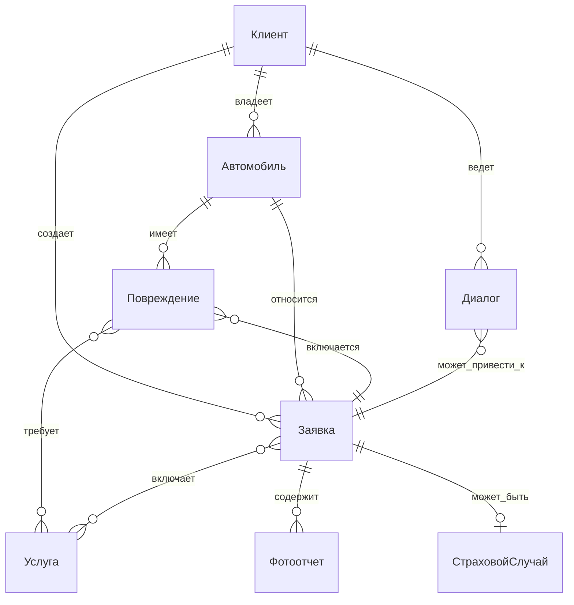

# 🏗️ Domain Models - Доменные модели

**Обновлено:** 26.10.2025
**Статус:** ✅ **Основные модели определены**
**Версия:** 1.0

## 🎯 Назначение

Этот документ описывает основные доменные модели AI-ассистента Valera, их атрибуты, поведения и взаимосвязи. Модели формализуют бизнес-сущности кузовного ремонта и обеспечивают основу для AI-понимания и разработки.

## 📋 Основные доменные модели

### 1. **Клиент (Customer)**

**Описание:** Физическое лицо, владелец автомобиля, взаимодействующее с AI-ассистентом

**Атрибуты:**
- `id` - Уникальный идентификатор (Telegram ID)
- `first_name` - Имя клиента
- `username` - Telegram username (@handle)
- `phone_number` - Контактный телефон
- `communication_preference` - Предпочтительный способ связи
- `language` - Язык коммуникации (русский)
- `created_at` - Дата первого обращения
- `last_interaction` - Дата последнего взаимодействия
- `status` - Статус клиента (new, active, returning, inactive)

**Поведение:**
- Инициирует диалог с AI-ассистентом
- Предоставляет информацию об автомобиле и повреждениях
- Принимает решения о ремонте и записи
- Оценивает качество обслуживания

**Связи:**
- 1:* → Автомобили
- 1:* → Заявки
- 1:* → Диалоги

### 2. **Автомобиль (Vehicle)**

**Описание:** Транспортное средство клиента, нуждающееся в ремонте или обслуживании

**Атрибуты:**
- `id` - Уникальный идентификатор
- `customer_id` - ID владельца
- `make` - Марка (Toyota, BMW, Lada)
- `model` - Модель (Camry, X5, Granta)
- `year` - Год выпуска
- `color` - Цвет кузова
- `vin` - VIN-код (если известен)
- `license_plate` - Государственный номер
- `body_type` - Тип кузова (седан, хэтчбек, SUV)
- `created_at` - Дата добавления в систему

**Поведение:**
- Является объектом ремонтных работ
- Накапливает историю повреждений и ремонтов
- Участвует в страховых случаях

**Связи:**
- *:1 → Клиент
- 1:* → Повреждения
- 1:* → Заявки

### 3. **Повреждение (Damage)**

**Описание:** Конкретное повреждение элемента кузова, требующее ремонта

**Атрибуты:**
- `id` - Уникальный идентификатор
- `vehicle_id` - ID автомобиля
- `body_element` - Элемент кузова (передняя дверь, бампер, крыло)
- `damage_type` - Тип повреждения (вмятина, царапина, трещина, деформация)
- `severity` - Степень тяжести (легкая, средняя, тяжелая)
- `description` - Текстовое описание повреждения
- `location` - Местоположение на элементе (верх, низ, центр)
- `size` - Примерные размеры повреждения
- `photos` - Ссылки на фотографии повреждения
- `estimated_repair_method` - Предполагаемый метод ремонта
- `preliminary_cost` - Предварительная стоимость ремонта
- `requires_inspection` - Требуется ли очный осмотр
- `insurance_relevant` - Относится ли к страховому случаю
- `created_at` - Дата фиксации повреждения

**Поведение:**
- Анализируется через AI-визуальный анализ
- Оценивается по стоимости и методам ремонта
- Включается в заявки на ремонт
- Участвует в страховых случаях

**Связи:**
- *:1 → Автомобиль
- *:* → Заявки (через RepairItem)

### 4. **Услуга (Service)**

**Описание:** Конкретная услуга по ремонту или обслуживанию кузова

**Атрибуты:**
- `id` - Уникальный идентификатор
- `name` - Наименование услуги
- `category` - Категория (PDR, покраска, полировка, замена)
- `description` - Подробное описание услуги
- `base_price` - Базовая стоимость
- `price_unit` - Единица измерения цены (за элемент, за м², за час)
- `estimated_duration` - Примерное время выполнения
- `complexity_level` - Уровень сложности (простой, средний, сложный)
- `required_equipment` - Необходимое оборудование
- `required_skills` - Требуемые навыки специалиста
- `is_active` - Активность услуги

**Поведение:**
- Предлагается AI на основе анализа повреждений
- Включается в расчет стоимости
- Выполняется специалистами сервиса

**Связи:**
- *:* → Заявки (через RepairItem)

### 5. **Заявка (ServiceRequest)**

**Описание:** Формализованный запрос на ремонт или консультацию

**Атрибуты:**
- `id` - Уникальный идентификатор
- `customer_id` - ID клиента
- `vehicle_id` - ID автомобиля
- `status` - Статус (new, confirmed, in_progress, completed, cancelled)
- `request_type` - Тип заявки (consultation, repair, insurance, inspection)
- `description` - Описание запроса клиента
- `preferred_date` - Предпочтительная дата
- `preferred_time` - Предпочтительное время
- `urgency` - Срочность (low, normal, high)
- `total_estimated_cost` - Общая предварительная стоимость
- `estimated_duration` - Предполагаемая продолжительность
- `assigned_manager_id` - ID назначенного менеджера
- `created_at` - Дата создания
- `updated_at` - Дата последнего обновления
- `notes` - Заметки менеджера

**Поведение:**
- Создается AI на основе диалога с клиентом
- Передается менеджеру для обработки
- Обновляется на протяжении всего процесса обслуживания

**Связи:**
- *:1 → Клиент
- *:1 → Автомобиль
- 1:* → RepairItems
- 1:* → Фотоотчеты

### 6. **Страховой случай (InsuranceClaim)**

**Описание:** Ситуация, связанная с ДТП и страховым возмещением

**Атрибуты:**
- `id` - Уникальный идентификатор
- `service_request_id` - ID связанной заявки
- `insurance_type` - Тип страховки (ОСАГО, КАСКО)
- `insurance_company` - Страховая компания
- `policy_number` - Номер полиса
- `incident_date` - Дата ДТП
- `incident_description` - Описание происшествия
- `claim_status` - Статус страхового случая (draft, submitted, approved, rejected)
- `required_documents` - Список требуемых документов
- `document_photos` - Фотографии документов
- `estimated_coverage` - Предполагаемое покрытие страховки
- `deductible` - Франшиза
- `created_at` - Дата создания

**Поведение:**
- Инициируется при упоминании ДТП в диалоге
- Требует сбора и проверки документов
- Влияет на процесс ремонта и оплаты

**Связи:**
- 1:1 → Заявка
- 1:* → Документы

### 7. **Диалог (Conversation)**

**Описание:** История взаимодействия клиента с AI-ассистентом

**Атрибуты:**
- `id` - Уникальный идентификатор
- `customer_id` - ID клиента
- `started_at` - Дата начала диалога
- `last_message_at` - Дата последнего сообщения
- `status` - Статус (active, paused, completed, transferred)
- `context_summary` - Краткое содержание диалога
- `messages_count` - Количество сообщений
- `ai_confidence_score` - Оценка уверенности AI
- `escalation_required` - Требуется ли передача менеджеру
- `related_service_request_id` - ID связанной заявки

**Поведение:**
- Накапливает контекст для AI-взаимодействий
- Сохраняется для анализа качества
- Используется для улучшения AI-моделей

**Связи:**
- *:1 → Клиент
- *:1 → Заявка (опционально)

## 🔗 Взаимосвязи моделей



## 📊 Жизненные циклы моделей

### **Жизненный цикл Заявки:**
```
new → confirmed → in_progress → completed
  ↓         ↓           ↓
cancelled  cancelled   cancelled
```

### **Жизненный цикл Повреждения:**
```
identified → analyzed → quoted → repaired → verified
```

### **Жизненный цикл Диалога:**
```
active → paused → completed
   ↓       ↓        ↓
transferred → resumed → archived
```

## 🎯 Контекстные ограничения (Bounded Contexts)

### **Консультационный контекст:**
- Фокус: Диалог, Повреждение, Услуга
- Цель: Предоставление экспертной консультации
- Результат: Понимание потребностей клиента

### **Контекст фотоанализа:**
- Фокус: Повреждение, Фотоотчет, Автомобиль
- Цель: Визуальная оценка и классификация
- Результат: Предварительная стоимость и методы ремонта

### **Страховой контекст:**
- Фокус: Страховой случай, Документы, Заявка
- Цель: Помощь в оформлении страховки
- Результат: Подготовленный пакет документов

### **Контекст записи на сервис:**
- Фокус: Заявка, Клиент, Автомобиль
- Цель: Бронирование времени и передача менеджеру
- Результат: Созданная и переданная заявка

## 🔄 Правила домена

### **Бизнес-правила:**
1. Каждая заявка должна иметь хотя бы одно повреждение
2. Предварительная оценка может отличаться от финальной не более чем на 20%
3. Страховой случай требует обязательного фотоотчета
4. AI не может создавать заявки без подтверждения клиента

### **Валидационные правила:**
1. VIN-код должен соответствовать формату производителя
2. Стоимость не может быть отрицательной
3. Дата ДТП не может быть в будущем
4. Телефон клиента должен быть валидным

## 🔗 Связанные документы

- **Terminology:** `terminology.md` - Объединенная терминология и бизнес-правила
- **Bounded Contexts:** `bounded-contexts.md` - Контекстуальные границы

---

**Последнее обновление:** 26.10.2025
**Ответственный:** Domain Expert
**Версия:** 1.0