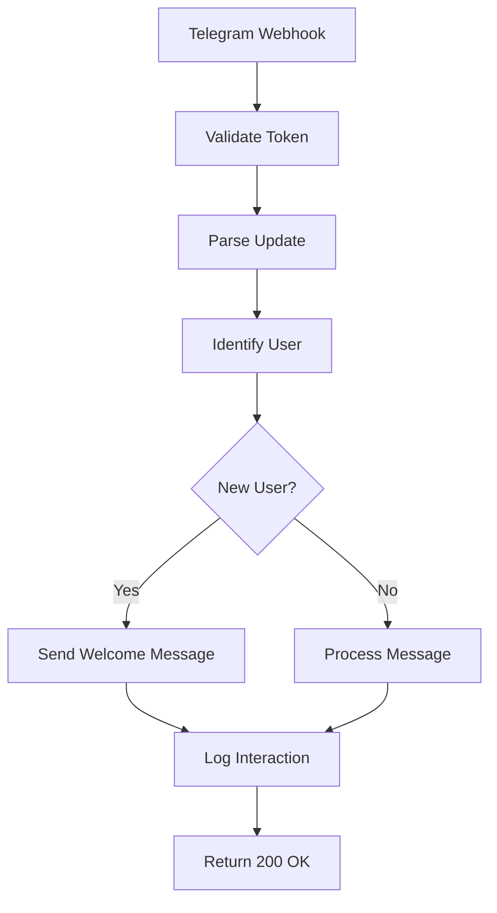

# API Specification: Telegram Webhook v1

**Версия:** 1.0
**Статус:** Production
**Создан:** 25.10.2025
**Автор:** API Team

## 📋 Обзор

API для обработки Telegram webhook'ов в системе Super Valera Bot через единственный `Telegram::WebhookController`. Обеспечивает прием входящих сообщений от Telegram и их обработку в реальном времени.

## 🌐 Endpoints

### POST /api/v1/telegram/webhook

Основной endpoint для приема webhook'ов от Telegram Bot API.

#### Request
**Method:** `POST`
**Content-Type:** `application/json`
**Authentication:** Token-based (секретный токен в header)

**Headers:**
```
X-Telegram-Bot-Api-Secret-Token: [secret_token]
Content-Type: application/json
```

**Request Body:** Telegram Update object (согласно Telegram Bot API documentation)

Пример запроса:
```json
{
  "update_id": 123456789,
  "message": {
    "message_id": 1,
    "from": {
      "id": 123456789,
      "is_bot": false,
      "first_name": "Иван",
      "last_name": "Петров",
      "username": "ivan_petrov",
      "language_code": "ru"
    },
    "chat": {
      "id": 123456789,
      "first_name": "Иван",
      "last_name": "Петров",
      "username": "ivan_petrov",
      "type": "private"
    },
    "date": 1698234567,
    "text": "/start"
  }
}
```

#### Response
**Status Codes:**
- `200 OK` - Webhook успешно обработан
- `400 Bad Request` - Неверный формат запроса
- `401 Unauthorized` - Неверный секретный токен
- `500 Internal Server Error` - Ошибка сервера

**Response Body:** Пустой для успешных ответов

Пример ответа с ошибкой:
```json
{
  "error": {
    "code": "INVALID_REQUEST_FORMAT",
    "message": "Invalid request format",
    "details": "Missing required field: message"
  }
}
```

## 🔒 Authentication & Security

### Secret Token Validation
Каждый webhook запрос должен содержать секретный токен в заголовке `X-Telegram-Bot-Api-Secret-Token`.

```ruby
# Пример валидации токена
def valid_webhook_token?(request)
  secret_token = request.headers['X-Telegram-Bot-Api-Secret-Token']
  secret_token == Rails.application.config.telegram[:webhook_secret]
end
```

### IP Whitelist
Только IP адреса из диапазонов Telegram могут обращаться к webhook endpoint.

## 📝 Message Types Support

### Поддерживаемые типы обновлений:
- `message` - Текстовые сообщения (только естественный диалог)

### Поддерживаемые типы сообщений:
- `text` - Текстовые сообщения (естественный язык)
- `location` - Геолокация (в будущем, через естественный диалог)
- `contact` - Контакты (в будущем, через естественный диалог)

**ВАЖНО:** В соответствии с Product Constitution, бот поддерживает **только dialogue-only взаимодействие**. Команды, кнопки и inline клавиатуры **не поддерживаются** и **не будут реализовываться**.

## 🔄 Processing Flow



## ⚡ Performance Requirements

### Response Time
- **Target:** < 200ms для 95% запросов
- **Maximum:** 500ms для любых запросов
- **Timeout:** 30 секунд для webhook обработки

### Rate Limiting
- **Per User:** 30 сообщений в минуту
- **Per IP:** 100 запросов в минуту
- **Global:** 1000 запросов в минуту

## 🚨 Error Handling

### Error Response Format
```json
{
  "error": {
    "code": "ERROR_CODE",
    "message": "Human readable error message",
    "details": {
      "field": "Specific error details",
      "timestamp": "2025-10-25T18:30:00Z"
    }
  }
}
```

### Error Codes
- `INVALID_TOKEN` - Неверный секретный токен
- `INVALID_FORMAT` - Неверный формат запроса
- `USER_BLOCKED` - Пользователь заблокировал бота
- `RATE_LIMIT_EXCEEDED` - Превышен лимит запросов
- `INTERNAL_ERROR` - Внутренняя ошибка сервера

### Retry Strategy
- **HTTP 429:** Экспоненциальный backoff (1s, 2s, 4s, 8s, 16s)
- **HTTP 5xx:** 3 попытки с интервалом 5 секунд
- **Timeout:** Повторная попытка через 10 секунд

## 📊 Monitoring & Logging

### Log Format
```json
{
  "timestamp": "2025-10-25T18:30:00Z",
  "level": "INFO",
  "event": "webhook_received",
  "update_id": 123456789,
  "user_id": 123456789,
  "message_type": "text",
  "processing_time_ms": 150,
  "status": "success"
}
```

### Metrics
- `webhook.requests.total` - Общее количество webhook запросов
- `webhook.requests.duration` - Время обработки запросов
- `webhook.errors.total` - Количество ошибок
- `welcome.messages.sent` - Количество отправленных приветствий

## 🔗 Integration Points

### Internal Services
- **UserService:** Управление пользователями
- **WelcomeService:** Генерация приветствий
- **MessageService:** Обработка сообщений

### External Dependencies
- **Telegram Bot API:** Отправка ответов
- **Redis:** Кэширование пользовательских сессий
- **PostgreSQL:** Хранение данных пользователей

## 📋 Examples

### Пример 1: Новое пользовательское сообщение
**Request:**
```json
{
  "update_id": 123456789,
  "message": {
    "message_id": 1,
    "from": {"id": 123456789, "first_name": "Иван"},
    "chat": {"id": 123456789, "type": "private"},
    "date": 1698234567,
    "text": "Привет"
  }
}
```

**Expected Actions:**
1. Определить пользователя как нового
2. Создать запись в Chat модели
3. Отправить приветственное сообщение
4. Создать запись в Message модели
5. Вернуть HTTP 200

### Пример 2: Текстовое сообщение (естественный диалог)
**Request:**
```json
{
  "update_id": 123456790,
  "message": {
    "message_id": 2,
    "from": {"id": 123456789, "first_name": "Иван"},
    "chat": {"id": 123456789, "type": "private"},
    "date": 1640995200,
    "text": "Хочу записаться на диагностику"
  }
}
```

**Expected Actions:**
1. Обработать текстовое сообщение как естественный диалог
2. Запустить AI-ассистента для генерации ответа
3. Вернуть HTTP 200

**ВАЖНО:** Все взаимодействия обрабатываются как естественный диалог через AI. Callback queries и команды **не поддерживаются**.

## 🧪 Testing

### Unit Tests
- Валидация секретного токена
- Парсинг различных типов сообщений
- Обработка ошибок

### Integration Tests
- End-to-end webhook processing
- Взаимодействие с базой данных
- Отправка сообщений в Telegram

### Load Testing
- 1000 одновременных запросов
- Пиковая нагрузка 100 RPS
- Проверка времени отклика

---

**История изменений:**
- 25.10.2025 14:30 - v1.0: Создана спецификация
- 25.10.2025 18:00 - v1.0: Добавлены примеры и тестирование