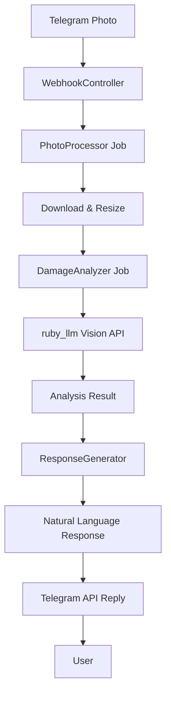

# Technical Solution: TSOL-002 - Telegram Damage Assessment Implementation

**Статус:** Draft
**Приоритет:** High
**Сложность:** Complex
**Создан:** 25.10.2025
**Автор:** Solution Architect
**Обновлен:** 25.10.2025 (Initial version)
**User Story:** [US-002a-telegram-basic-consultation.md](../user-stories/US-002a-telegram-basic-consultation.md)
**Technical Specification:** [TS-002-telegram-booking-engine.md](../specifications/TS-002-telegram-booking-engine.md)

> **🚨 ВАЖНО: Technical Solution vs Specification**
> - **Requirements (в User Story)** - ЧТО хочет пользователь (получить оценку повреждений авто)
> - **Specification (TS-002)** - ЧТО должна делать система (анализ фото, определение повреждений)
> - **Technical Solution (TSOL-002)** - КАК это реализовать (архитектура, ruby_llm интеграция)

## 📋 Executive Summary

**Краткое описание:** Реализация системы анализа фотографий повреждений автомобиля через Telegram с использованием AI для автоматической оценки ущерба.
**Основной подход:** Event-driven архитектура с асинхронной обработкой изображений через ruby_llm gem.
**Ключевые технологии:** Ruby on Rails 8.1, ruby_llm gem, telegram-bot gem, ActiveStorage, Solid Queue.
**Ожидаемый результат:** Пользователи могут отправлять фото повреждений через Telegram и получать AI-анализ с оценкой стоимости ремонта.

## 🎯 Контекст и требования

### User Story
- **Описание:** Владелец автомобиля хочет получить предварительную оценку повреждений через Telegram
- **Основная цель:** Автоматизация первоначальной диагностики повреждений
- **Бизнес-ценность:** Сокращение времени на оценку, улучшение клиентского опыта

### Technical Requirements
```yaml
functional_requirements:
  - "Прием фотографий через Telegram webhook"
  - "AI анализ повреждений с точностью > 90%"
  - "Формирование текстового заключения на русском языке"
  - "Предварительная оценка стоимости ремонта"
  - "История консультаций в рамках чата"

non_functional_requirements:
  performance: "Response time < 30 seconds for AI analysis"
  scalability: "Support 100 concurrent photo uploads"
  availability: "99.5% uptime during business hours"
  security: "GDPR compliance for EU users"

constraints:
  technology: "Must use ruby_llm gem with vision model"
  integration: "Telegram Bot API compatibility"
  budget: "Development time < 10 days"
```

## 🏗️ Техническая архитектура

### Архитектурный подход
```yaml
pattern: "Event-driven microservices within Rails"
approach: "Asynchronous processing with job queues"
style: "Hexagonal architecture with ports and adapters"
```

### Компоненты системы
```yaml
components:
  - name: "TelegramWebhookController"
    responsibility: "Receive and validate Telegram webhooks"
    technology: "Rails Controller + telegram-bot gem"
    dependencies: ["MessageProcessor"]
    scaling: "Stateless, horizontally scalable"

  - name: "PhotoProcessor"
    responsibility: "Download and preprocess images"
    technology: "ActiveJob + ActiveStorage + ImageProcessing"
    dependencies: ["Telegram API", "S3/Local storage"]
    scaling: "Background job processing"

  - name: "DamageAnalyzer"
    responsibility: "AI analysis of vehicle damage"
    technology: "ruby_llm gem + vision model"
    dependencies: ["PhotoProcessor", "PromptTemplates"]
    scaling: "Queue-based with retry logic"

  - name: "ResponseGenerator"
    responsibility: "Generate natural language responses"
    technology: "ruby_llm + Chat model"
    dependencies: ["DamageAnalyzer", "ChatContext"]
    scaling: "Synchronous processing"

  - name: "ConsultationService"
    responsibility: "Manage consultation lifecycle"
    technology: "Rails Service object"
    dependencies: ["Chat model", "DamageAssessment model"]
    scaling: "Stateless service"
```

### Интеграции
```yaml
internal_integrations:
  - system: "ruby_llm"
    type: "Direct integration with acts_as_chat"
    data_flow: "Image upload → AI analysis → Response generation"
    error_handling: "Retry with exponential backoff, fallback responses"

external_integrations:
  - system: "Telegram Bot API"
    type: "Webhook receiver + Bot API calls"
    authentication: "Bot token"
    rate_limits: "30 requests per second, implement queuing"
```

## 📊 Data Architecture

### Data Models
```yaml
models:
  - name: "Consultation"
    purpose: "Damage assessment session"
    key_fields: ["chat_id", "status", "created_at", "completed_at"]
    relationships: "belongs_to :chat, has_many :damage_assessments"
    indexing: "index on chat_id and status"

  - name: "DamageAssessment"
    purpose: "Individual damage analysis results"
    key_fields: ["consultation_id", "photo_key", "analysis_result", "confidence_score"]
    relationships: "belongs_to :consultation, has_many_attached :photos"
    indexing: "index on consultation_id and created_at"

  - name: "DamageCategory"
    purpose: "Predefined damage types and costs"
    key_fields: ["name", "description", "base_cost", "complexity_factor"]
    relationships: "has_many :damage_assessments"
    indexing: "index on name"
```

### Data Flow


### Cache Strategy
```yaml
cache_layers:
  - layer: "Analysis results cache"
    technology: "Redis"
    ttl: "24 hours"
    invalidation: "On new analysis request"

  - layer: "Prompt templates cache"
    technology: "Rails.cache"
    ttl: "1 hour"
    invalidation: "On template update"
```

## 🔧 Implementation Strategy

### Phases of Development
```yaml
phase_1:
  name: "Foundation"
  description: "Core models and webhook setup"
  effort: "3 days"
  deliverables:
    - "Consultation and DamageAssessment models"
    - "TelegramWebhookController"
    - "Basic photo upload functionality"
  dependencies: "Database setup, telegram-bot configuration"

phase_2:
  name: "AI Integration"
  description: "ruby_llm integration for damage analysis"
  effort: "4 days"
  deliverables:
    - "DamageAnalyzer service with ruby_llm"
    - "Prompt engineering for damage detection"
    - "Basic analysis workflow"
  dependencies: "Phase 1 completion, ruby_llm configuration"

phase_3:
  name: "Response Generation"
  description: "Natural language response system"
  effort: "2 days"
  deliverables:
    - "ResponseGenerator with chat context"
    - "Russian language response templates"
    - "Cost estimation logic"
  dependencies: "Phase 2 completion"

phase_4:
  name: "Polish & Testing"
  description: "Error handling and comprehensive testing"
  effort: "1 day"
  deliverables:
    - "Comprehensive error handling"
    - "Test coverage > 90%"
    - "Performance optimization"
  dependencies: "Phase 3 completion"
```

### Technology Stack
```yaml
backend:
  framework: "Ruby on Rails 8.1"
  database: "PostgreSQL"
  cache: "Redis"
  queue: "Solid Queue"

ai_integration:
  library: "ruby_llm gem (~> 1.8)"
  provider: "OpenAI GPT-4 Vision"
  model: "gpt-4-vision-preview"
  prompt_style: "Russian language, car service domain"

external_services:
  telegram: "telegram-bot gem"
  storage: "Active Storage with local/S3"
  monitoring: "Rails logs + custom metrics"
```

## ⚠️ Risk Analysis

### Technical Risks
```yaml
high_risks:
  - risk: "AI model accuracy below 90% for damage detection"
    probability: "Medium"
    impact: "High"
    mitigation: "Confidence thresholds, human review workflow"
    owner: "AI Team"

  - risk: "Large image processing causing timeouts"
    probability: "Medium"
    impact: "High"
    mitigation: "Background processing + image resizing"
    owner: "Backend Team"

  - risk: "Telegram API rate limiting during peak usage"
    probability: "Medium"
    impact: "Medium"
    mitigation: "Request queuing + exponential backoff"
    owner: "Integration Team"

medium_risks:
  - risk: "ruby_llm gem configuration complexity"
    probability: "Low"
    impact: "Medium"
    mitigation: "Thorough gem study + reference examples"
    owner: "Development Team"
```

### Business Risks
```yaml
business_risks:
  - risk: "User dissatisfaction with AI accuracy"
    probability: "Low"
    impact: "High"
    mitigation: "Clear communication about AI limitations"

  - risk: "GDPR compliance issues with photo storage"
    probability: "Medium"
    impact: "High"
    mitigation: "Data retention policies + anonymization"
```

## 🧪 Testing Strategy

### Test Coverage
```yaml
unit_tests:
  components: "Models, Services, DamageAnalyzer"
  coverage_target: "90%+"
  tools: "Minitest, FactoryBot, VCR for external APIs"

integration_tests:
  apis: "Telegram webhook, ruby_llm integration"
  workflows: "Complete photo analysis flow"
  coverage_target: "85%+"

e2e_tests:
  scenarios: "User sends photo → receives analysis"
  environment: "Staging with real Telegram bot"
  frequency: "Before each release"
```

### Performance Testing
```yaml
load_testing:
  tool: "k6"
  scenarios: "50 concurrent photo uploads"
  target: "Average response time < 30s"

stress_testing:
  tool: "k6"
  scenarios: "100 concurrent photo uploads"
  target: "System remains responsive"
```

## 📈 Monitoring and Observability

### Metrics to Track
```yaml
business_metrics:
  - "Photo analysis completion rate"
  - "User satisfaction with results"
  - "Average consultation duration"

technical_metrics:
  - "Photo processing time (p95)"
  - "AI analysis success rate"
  - "Error rate by component"
  - "Queue depth and processing time"
```

### Alerting
```yaml
critical_alerts:
  - "AI analysis failure rate > 20%"
  - "Photo processing time > 60 seconds"
  - "Telegram webhook failures"

warning_alerts:
  - "Queue backlog > 10 jobs"
  - "AI confidence score < 70%"
  - "Storage usage > 80%"
```

## 🚀 Deployment Strategy

### Release Plan
```yaml
environment_strategy:
  development: "Local testing with sample photos"
  staging: "Test Telegram bot with real photo uploads"
  production: "Gradual rollout to 10% of users"

deployment_method:
  approach: "Blue-Green deployment"
  rollback: "Automated rollback on >10% error rate"
  health_checks: "Webhook endpoint + job processing health"
```

### Rollback Plan
```yaml
rollback_triggers:
  - "AI analysis accuracy < 80%"
  - "Response time degradation > 50%"
  - "User complaints > 5 per hour"

rollback_steps:
  1. "Switch to previous AI model version"
  2. "Disable photo analysis feature"
  3. "Notify users about temporary unavailability"
  4. "Analyze root cause and fix"
```

## 📚 Documentation Requirements

### Technical Documentation
- [ ] ruby_llm integration guide
- [ ] Telegram webhook configuration
- [ ] AI prompt engineering documentation
- [ ] Troubleshooting guide for common issues

### User Documentation
- [ ] User guide for photo submission
- [ ] FAQ about damage analysis
- [ ] Support team escalation procedures

## ✅ Success Criteria

### Functional Success
- [ ] User can submit photos via Telegram
- [ ] AI analyzes damage with >90% accuracy
- [ ] Natural language Russian responses generated
- [ ] Cost estimation provided

### Non-Functional Success
- [ ] Photo processing < 30 seconds
- [ ] System handles 50 concurrent uploads
- [ ] 99.5% uptime during business hours
- [ ] GDPR compliance verified

### Business Success
- [ ] User acceptance testing passed
- [ ] Average consultation time reduced by 60%
- [ ] Customer satisfaction > 4.5/5

## 📋 Implementation Checklist

### Pre-Implementation
- [ ] ruby_llm gem studied and configured
- [ ] Telegram bot token and webhook configured
- [ ] Database models designed and reviewed
- [ ] AI prompts drafted and tested

### During Implementation
- [ ] All code follows Rails conventions
- [ ] Comprehensive error handling implemented
- [ ] Test coverage maintained above 90%
- [ ] Regular code reviews conducted

### Post-Implementation
- [ ] Load testing completed successfully
- [ ] Security review passed
- [ ] Documentation completed and published
- [ ] Monitoring and alerting configured

## 🔄 Alternative Approaches (Rejected)

### Option 1: Direct OpenAI API Integration
**Description:** Use OpenAI API directly without ruby_llm gem
**Pros:** More control over API calls, potentially cheaper
**Cons:** More complex error handling, loses Rails integration benefits
**Why rejected:** ruby_llm gem provides better Rails integration and maintainability

### Option 2: External Image Processing Service
**Description:** Use specialized car damage analysis API
**Pros:** Higher accuracy, specialized domain knowledge
**Cons:** Additional cost, vendor dependency, less flexibility
**Why rejected:** Cost constraints and desire to maintain control over AI logic

## 📝 Notes and Decisions

### Key Decisions Made
1. **ruby_llm gem adoption:** Provides Rails-native AI integration with proper error handling
2. **Asynchronous processing:** Background jobs prevent webhook timeouts
3. **Russian language focus:** All prompts and responses in Russian for target market
4. **Conservative rollout:** Gradual user rollout to monitor AI performance

### Open Questions
- **AI model selection:** Should we test multiple vision models for accuracy comparison?
- **Cost estimation accuracy:** How to calibrate cost estimates without historical data?

### Assumptions
- **Users have basic photography skills:** Clear photos will be provided
- **Telegram API stability:** Reliable webhook delivery expected
- **AI model availability:** Vision model will remain accessible and stable

---

## 📊 Change Log

| Дата | Версия | Изменение | Автор |
|------|--------|-----------|-------|
| 25.10.2025 | 1.0 | Initial technical solution design | Solution Architect |

---

**Approval:**
- [ ] Solution Architect: ____________________ Date: _______
- [ ] Tech Lead: ____________________________ Date: _______
- [ ] Product Manager: ______________________ Date: _______