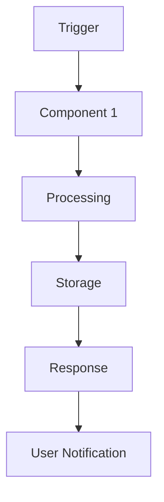

# Technical Solution: TSOL-XXX - [Название решения]

**Статус:** Draft/Review/Approved/Implemented
**Приоритет:** High/Medium/Low
**Сложность:** Simple/Medium/Complex
**Создан:** DD.MM.YYYY
**Автор:** [имя Solution Architect]
**Обновлен:** DD.MM.YYYY (описание изменений)
**User Story:** [ссылка на US-XXX]
**Technical Specification:** [ссылка на TS-XXX]

> **🚨 ВАЖНО: Technical Solution vs Specification**
> - **Requirements (в User Story)** - ЧТО хочет пользователь (бизнес-цель)
> - **Specification (TS-XXX)** - ЧТО должна делать система (технические требования к поведению)
> - **Technical Solution (TSOL-XXX)** - КАК это реализовать (архитектура, компоненты, технологии)

## 📋 Executive Summary

**Краткое описание:** [1-2 предложения о решении]
**Основной подход:** [выбранный архитектурный подход]
**Ключевые технологии:** [список основных технологий]
**Ожидаемый результат:** [что получим после реализации]

## 🎯 Контекст и требования

### User Story
- **Описание:** [краткое описание User Story]
- **Основная цель:** [что хочет достичь пользователь]
- **Бизнес-ценность:** [почему это важно]

### Technical Requirements
```yaml
functional_requirements:
  - "Требование 1 из TS-XXX"
  - "Требование 2 из TS-XXX"

non_functional_requirements:
  performance: "Response time < X seconds"
  scalability: "Support for N concurrent users"
  availability: "99.9% uptime"
  security: "Compliance with XYZ"

constraints:
  technology: "Must use ruby_llm gem"
  integration: "Telegram API compatibility"
  budget: "Development time < X days"
```

## 🏗️ Техническая архитектура

### Архитектурный подход
```yaml
pattern: "Event-driven / Microservices / Monolith / Serverless"
approach: "Synchronous / Asynchronous / Hybrid"
style: "Layered architecture / Hexagonal / Clean architecture"
```

### Компоненты системы
```yaml
components:
  - name: "Component Name"
    responsibility: "What this component does"
    technology: "Rails model / Service / Job"
    dependencies: ["Other components", "External APIs"]
    scaling: "Horizontal / Vertical / Stateless"

  - name: "Another Component"
    responsibility: "Integration with external system"
    technology: "Background job / External API client"
    dependencies: ["Database", "Redis"]
    scaling: "Queue-based processing"
```

### Интеграции
```yaml
internal_integrations:
  - system: "ruby_llm"
    type: "API calls / Direct integration"
    data_flow: "Request → Process → Response"
    error_handling: "Retry logic with exponential backoff"

external_integrations:
  - system: "Telegram API"
    type: "Webhook / Bot API calls"
    authentication: "Bot token"
    rate_limits: "30 requests per second"
```

## 📊 Data Architecture

### Data Models
```yaml
models:
  - name: "ModelName"
    purpose: "What this model stores"
    key_fields: ["field1", "field2", "field3"]
    relationships: "belongs_to / has_many / etc"
    indexing: "Indexes for performance"

  - name: "AnotherModel"
    purpose: "Supporting data structure"
    key_fields: ["field1", "field2"]
    relationships: "Associations"
```

### Data Flow


### Cache Strategy
```yaml
cache_layers:
  - layer: "Application cache"
    technology: "Redis / Rails.cache"
    ttl: "15 minutes"
    invalidation: "On data change"

  - layer: "Query cache"
    technology: "Database query cache"
    ttl: "5 minutes"
    invalidation: "Automatic"
```

## 🔧 Implementation Strategy

### Phases of Development
```yaml
phase_1:
  name: "Foundation"
  description: "Core functionality setup"
  effort: "X days"
  deliverables:
    - "Database models"
    - "Basic controllers"
    - "Core services"
  dependencies: "Database setup"

phase_2:
  name: "Integration"
  description: "External systems integration"
  effort: "Y days"
  deliverables:
    - "API clients"
    - "Webhook handlers"
    - "Error handling"
  dependencies: "Phase 1 completion"

phase_3:
  name: "Optimization"
  description: "Performance and scaling"
  effort: "Z days"
  deliverables:
    - "Caching layer"
    - "Background jobs"
    - "Monitoring"
  dependencies: "Phase 2 completion"
```

### Technology Stack
```yaml
backend:
  framework: "Ruby on Rails 8.1"
  database: "PostgreSQL"
  cache: "Redis"
  queue: "Solid Queue"

ai_integration:
  library: "ruby_llm gem"
  provider: "OpenAI / Anthropic / etc"
  model: "GPT-4 / Claude-3 / etc"

external_services:
  telegram: "telegram-bot gem"
  storage: "Active Storage"
  monitoring: "New Relic / DataDog"
```

## ⚠️ Risk Analysis

### Technical Risks
```yaml
high_risks:
  - risk: "Large file processing timeout"
    probability: "Medium"
    impact: "High"
    mitigation: "Background job processing with chunking"
    owner: "Backend Team"

  - risk: "AI model accuracy below requirements"
    probability: "Low"
    impact: "Medium"
    mitigation: "Confidence thresholds + fallback options"
    owner: "AI Team"

medium_risks:
  - risk: "Telegram API rate limiting"
    probability: "Medium"
    impact: "Medium"
    mitigation: "Request queuing + exponential backoff"
    owner: "Integration Team"
```

### Business Risks
```yaml
business_risks:
  - risk: "User adoption lower than expected"
    probability: "Low"
    impact: "High"
    mitigation: "User testing + gradual rollout"

  - risk: "Compliance issues with data processing"
    probability: "Medium"
    impact: "High"
    mitigation: "Legal review + data anonymization"
```

## 🧪 Testing Strategy

### Test Coverage
```yaml
unit_tests:
  components: "Models, Services, Utilities"
  coverage_target: "90%+"
  tools: "Minitest, FactoryBot"

integration_tests:
  apis: "External API integrations"
  workflows: "Complete user journeys"
  coverage_target: "80%+"

e2e_tests:
  scenarios: "Critical user paths"
  environment: "Staging"
  frequency: "Before each release"
```

### Performance Testing
```yaml
load_testing:
  tool: "k6 / JMeter"
  scenarios: "Peak load simulation"
  target: "1000 concurrent users"

stress_testing:
  tool: "Same as load testing"
  scenarios: "Beyond normal capacity"
  target: "Identify breaking points"
```

## 📈 Monitoring and Observability

### Metrics to Track
```yaml
business_metrics:
  - "User engagement rate"
  - "Feature adoption"
  - "Task completion rate"

technical_metrics:
  - "Response time (p95, p99)"
  - "Error rate"
  - "Throughput"
  - "Resource utilization"
```

### Alerting
```yaml
critical_alerts:
  - "Service down (> 5 min)"
  - "Error rate > 5%"
  - "Response time > 10s"

warning_alerts:
  - "High memory usage"
  - "Queue backlog growing"
  - "API rate limit approaching"
```

## 🚀 Deployment Strategy

### Release Plan
```yaml
environment_strategy:
  development: "Feature flags + local testing"
  staging: "Full feature testing"
  production: "Gradual rollout"

deployment_method:
  approach: "Blue-Green / Canary"
  rollback: "Automated rollback on failure"
  health_checks: "Readiness + Liveness probes"
```

### Rollback Plan
```yaml
rollback_triggers:
  - "Error rate > 10%"
  - "Response time degradation"
  - "User complaints"

rollback_steps:
  1. "Switch traffic to previous version"
  2. "Verify system health"
  3. "Communicate with stakeholders"
  4. "Analyze root cause"
```

## 📚 Documentation Requirements

### Technical Documentation
- [ ] API documentation (OpenAPI/Swagger)
- [ ] Database schema documentation
- [ ] Deployment runbooks
- [ ] Troubleshooting guides

### User Documentation
- [ ] User guide updates
- [ ] FAQ additions
- [ ] Support team training materials

## ✅ Success Criteria

### Functional Success
- [ ] All acceptance criteria from User Story met
- [ ] Technical Specification requirements fulfilled
- [ ] Integration tests passing

### Non-Functional Success
- [ ] Performance targets achieved
- [ ] Security requirements met
- [ ] Scalability tested and verified

### Business Success
- [ ] User acceptance testing passed
- [ ] Business metrics improved
- [ ] ROI positive within expected timeframe

## 📋 Implementation Checklist

### Pre-Implementation
- [ ] Technical Solution reviewed and approved
- [ ] Environment setup completed
- [ ] Dependencies identified and available
- [ ] Team members assigned and briefed

### During Implementation
- [ ] Code following coding standards
- [ ] Regular code reviews conducted
- [ ] Tests written for all components
- [ ] Documentation updated incrementally

### Post-Implementation
- [ ] Integration testing completed
- [ ] Performance testing passed
- [ ] Security review completed
- [ ] Deployment documentation ready

## 🔄 Alternative Approaches (Rejected)

### Option 1: [Название подхода]
**Description:** [Краткое описание]
**Pros:** [Преимущества]
**Cons:** [Недостатки]
**Why rejected:** [Причина отклонения]

### Option 2: [Название подхода]
**Description:** [Краткое описание]
**Pros:** [Преимущества]
**Cons:** [Недостатки]
**Why rejected:** [Причина отклонения]

## 📝 Notes and Decisions

### Key Decisions Made
1. **[Decision 1]:** [Reasoning and justification]
2. **[Decision 2]:** [Reasoning and justification]
3. **[Decision 3]:** [Reasoning and justification]

### Open Questions
- [Question 1]: [Context and what needs to be decided]
- [Question 2]: [Context and what needs to be decided]

### Assumptions
- **[Assumption 1]:** [What we're assuming to be true]
- **[Assumption 2]:** [What we're assuming to be true]

---

## 📊 Change Log

| Дата | Версия | Изменение | Автор |
|------|--------|-----------|-------|
| DD.MM.YYYY | 1.0 | Initial version | [Name] |
| DD.MM.YYYY | 1.1 | [Description of changes] | [Name] |

---

**Approval:**
- [ ] Solution Architect: ____________________ Date: _______
- [ ] Tech Lead: ____________________________ Date: _______
- [ ] Product Manager: ______________________ Date: _______