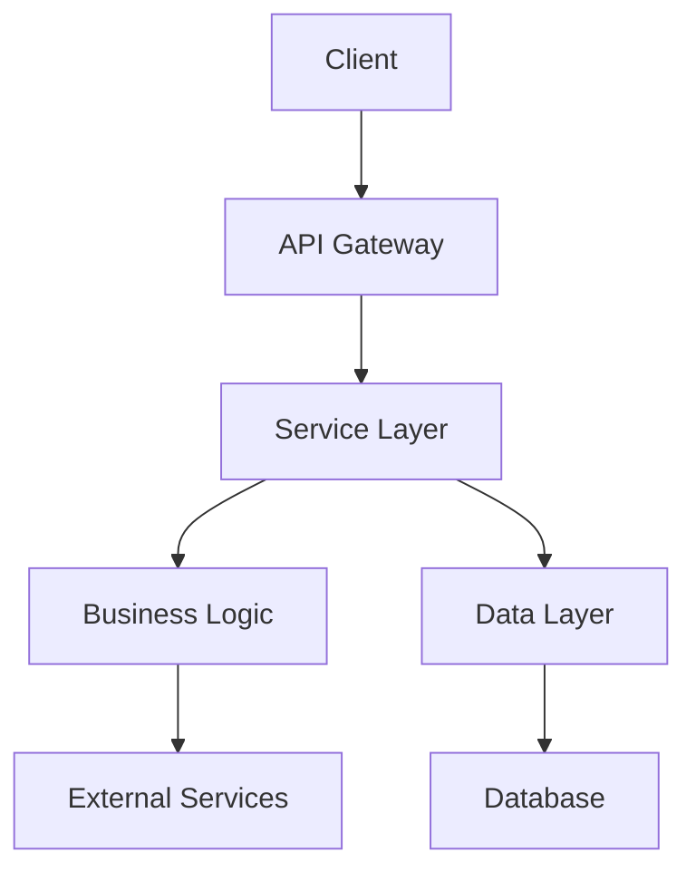

# Technical Design Document: TDD-XXX - [Название]

**Статус:** Draft/Ready/In Progress/Done
**Сложность:** Simple/Medium/Complex
**Приоритет:** High/Medium/Low
**Создан:** DD.MM.YYYY
**Обновлен:** DD.MM.YYYY
**User Story:** [US-XXX-название.md](US-XXX-название.md)

## 🎯 Технические требования

### Functional Requirements
- [ ] **[FR-001]:** [описание функционального требования]
- [ ] **[FR-002]:** [описание функционального требования]
- [ ] **[FR-003]:** [описание функционального требования]

### Non-Functional Requirements
- [ ] **Performance:** [требования к производительности]
  - Response time: < X ms (p95)
  - Throughput: > X requests/second
  - Concurrent users: X
- [ ] **Security:** [требования безопасности]
  - Authentication: [метод]
  - Authorization: [уровни доступа]
  - Data encryption: [тип]
- [ ] **Scalability:** [требования масштабируемости]
  - Horizontal scaling: [поддержка]
  - Load balancing: [метод]
- [ ] **Availability:** [требования доступности]
  - Uptime: > 99.9%
  - Disaster recovery: [план]

## 🏗️ Архитектура и компоненты

### System Architecture
```yaml
pattern: "Layered / Hexagonal / Event-driven"
approach: "Synchronous / Asynchronous / Hybrid"
style: "Modular / Service-oriented / Microservices"
```

### High-Level Architecture


### Components
```yaml
components:
  - name: "ComponentName"
    type: "Controller/Service/Model/Job/Utility"
    responsibility: "Что этот компонент делает"
    dependencies: ["Other components", "External APIs"]
    interfaces: ["методы и API endpoints"]
    scaling: "Horizontal/Vertical/Stateless"

  - name: "AnotherComponent"
    type: "Service/Repository"
    responsibility: "Поддерживающая функция"
    dependencies: ["Database", "Cache"]
    interfaces: ["repository pattern"]
    scaling: "Read replicas"
```

### Data Architecture
```yaml
data_models:
  - name: "ModelName"
    purpose: "Что хранит модель"
    key_fields: ["field1", "field2", "field3"]
    relationships: "belongs_to/has_many/has_one"
    indexing: ["indexed_fields"]
    validations: ["business_rules"]

data_flow:
  - source: "User input"
  - processing: "Service layer"
  - storage: "Database"
  - output: "API response"
```

## 📋 План реализации

### Phase 1: Foundation (X часов)
- [ ] **Database Design:**
  - [ ] Создать/модифицировать модели данных
  - [ ] Настроить migrations
  - [ ] Добавить indexes и constraints
- [ ] **Basic Structure:**
  - [ ] Создать контроллеры и routes
  - [ ] Настроить базовые сервисы
  - [ ] Добавить error handling foundation

### Phase 2: Core Logic (Y часов)
- [ ] **Business Logic:**
  - [ ] Реализовать основную бизнес-логику
  - [ ] Создать service классы
  - [ ] Добавить business rules validation
- [ ] **External Integrations:**
  - [ ] Настроить API клиенты
  - [ ] Реализовать retry logic
  - [ ] Добавить circuit breakers

### Phase 3: Features & Functionality (Z часов)
- [ ] **Core Features:**
  - [ ] Реализовать основные функции из User Story
  - [ ] Добавить edge cases handling
  - [ ] Настроить data processing
- [ ] **User Interface:**
  - [ ] API endpoints
  - [ ] Response formatting
  - [ ] Error responses

### Phase 4: Integration & Testing (W часов)
- [ ] **Testing:**
  - [ ] Unit тесты для всех компонентов
  - [ ] Integration тесты
  - [ ] E2E тесты для critical paths
- [ ] **Performance:**
  - [ ] Оптимизация запросов
  - [ ] Кэширование
  - [ ] Load testing

### Phase 5: Polish & Deployment (V часов)
- [ ] **Quality:**
  - [ ] Code review и рефакторинг
  - [ ] Логирование и мониторинг
  - [ ] Документация API
- [ ] **Deployment:**
  - [ ] Environment конфигурация
  - [ ] Migration scripts
  - [ ] Health checks

## ⚠️ Риски и зависимости

### Технические риски
```yaml
high_risks:
  - risk: "Critical component failure"
    probability: "Medium"
    impact: "High"
    mitigation: "Circuit breakers + fallback mechanisms"
    owner: "Tech Lead"

medium_risks:
  - risk: "Performance bottleneck"
    probability: "Medium"
    impact: "Medium"
    mitigation: "Caching + query optimization"
    owner: "Developer"

low_risks:
  - risk: "Third-party API limits"
    probability: "Low"
    impact: "Low"
    mitigation: "Rate limiting + queuing"
    owner: "Developer"
```

### Зависимости
```yaml
internal_dependencies:
  - component: "Existing Service"
    status: "Available"
    risks: "API changes"
    mitigation: "Version locking"

external_dependencies:
  - service: "External API"
    status: "Available"
    risks: "Downtime, rate limits"
    mitigation: "Retry logic + fallback"

infrastructure_dependencies:
  - resource: "Database"
    status: "Available"
    risks: "Performance at scale"
    mitigation: "Read replicas + indexing"
```

### Технологический стек
```yaml
backend:
  framework: "Ruby on Rails 8.1"
  language: "Ruby 3.4+"

database:
  primary: "PostgreSQL 15+"
  cache: "Redis 7+"
  search: "Elasticsearch (if needed)"

ai_ml:
  primary: "ruby_llm gem"
  models: "[specific models]"

external_services:
  - name: "Telegram API"
    purpose: "Bot communication"
  - name: "Payment gateway"
    purpose: "Transactions"

testing:
  framework: "Minitest"
  tools: "FactoryBot, Faker, WebMock"

deployment:
  platform: "Docker"
  orchestration: "Docker Compose / Kubernetes"
  monitoring: "New Relic / DataDog"
```

## 🧪 План тестирования

### Unit Testing
```yaml
models:
  coverage_target: "90%+"
  focus: "Validations, associations, business logic"

services:
  coverage_target: "85%+"
  focus: "Business rules, error handling"

controllers:
  coverage_target: "80%+"
  focus: "Request handling, responses"

utilities:
  coverage_target: "95%+"
  focus: "Pure functions, edge cases"
```

### Integration Testing
```yaml
api_endpoints:
  focus: "Happy path, error scenarios, authentication"
  tools: "Rails testing helpers, Postman/Newman"

database_operations:
  focus: "CRUD operations, transactions, constraints"

external_integrations:
  focus: "API calls, error handling, retries"
  tools: "WebMock, VCR"
```

### E2E Testing
```yaml
critical_user_journeys:
  - "Complete user flow from US-XXX"
  - "Error scenarios and recovery"

performance_testing:
  tool: "k6 / JMeter"
  scenarios: "Peak load, stress testing"
  targets: "Response time, throughput"

security_testing:
  focus: "Authentication, authorization, input validation"
  tools: "Brakeman, bundler-audit"
```

## 📊 Метрики успеха

### Technical Metrics
- [ ] **Response time:** < 2 seconds (p95)
- [ ] **Throughput:** > 100 requests/second
- [ ] **Error rate:** < 1%
- [ ] **Availability:** > 99.9%
- [ ] **Code coverage:** > 80%
- [ ] **Test success rate:** 100%

### Business Metrics (из User Story)
- [ ] **[Метрика 1]:** [цель из User Story]
- [ ] **[Метрика 2]:** [цель из User Story]

### Performance Metrics
- [ ] **Database query time:** < 100ms (p95)
- [ ] **Memory usage:** < 512MB per process
- [ ] **CPU usage:** < 70% under normal load

## 🔗 Связанные документы
- **User Story:** [US-XXX-название.md](US-XXX-название.md)
- **Dependencies:** [TDD-YYY, TDD-ZZZ]
- **External documentation:** [API docs, gem documentation]
- **Architecture decisions:** [ссылки на ADRs]

## 📝 Implementation Notes

### Phase Decisions:
1. **[Phase 1 Decision]:** [причина и обоснование]
2. **[Phase 2 Decision]:** [причина и обоснование]

### Technical Challenges:
- **[Challenge 1]:** [как решили]
- **[Challenge 2]:** [как решили]

### Lessons Learned:
- **[Lesson 1]:** [что узнали]
- **[Lesson 2]:** [что узнали]

## ✅ Completion Checklist

### Functional Requirements:
- [ ] All functional requirements implemented
- [ ] User Story criteria satisfied
- [ ] Edge cases handled
- [ ] Error scenarios covered

### Technical Requirements:
- [ ] Performance targets achieved
- [ ] Security requirements met
- [ ] Scalability tested
- [ ] Availability verified

### Quality Assurance:
- [ ] Unit tests written and passing
- [ ] Integration tests passing
- [ ] E2E tests passing
- [ ] Code review completed
- [ ] Security scan passed

### Documentation:
- [ ] API documentation updated
- [ ] Technical documentation complete
- [ ] Deployment guides updated
- [ ] Runbooks created

### Deployment Readiness:
- [ ] Environment configured
- [ ] Migration scripts tested
- [ ] Health checks implemented
- [ ] Monitoring configured
- [ ] Rollback plan ready

---

**Change log:**
| Дата | Версия | Изменение | Автор |
|------|--------|-----------|-------|
| DD.MM.YYYY | 1.0 | Initial version | [Name] |
| DD.MM.YYYY | 1.1 | [описание изменений] | [Name] |

---

**Approval:**
- [ ] Tech Lead: _________________________ Date: _______
- [ ] Senior Developer: __________________ Date: _______
- [ ] DevOps Engineer: ___________________ Date: _______